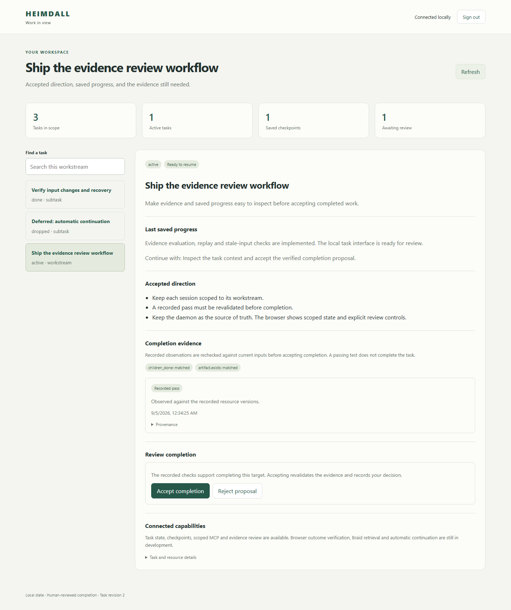

# Local task GUI — 0.7.0

The Go daemon serves an embedded TypeScript interface for inspecting one root task's subtree and reviewing completion. It runs alongside the CLI and MCP adapter. The extension is optional for the GUI; no separate frontend server or Node runtime is required after building Heimdall.

## Open a workstream

Start the daemon with your existing data directory, then request a session in another terminal:

```powershell
.\bin\heimdall.exe start --data-dir DATA
```

```powershell
.\bin\heimdall.exe ui ROOT_TASK --data-dir DATA
```

Replace `ROOT_TASK` with a task ID that has no parent; step IDs are not accepted. Open the returned `url` in your browser and enter the returned `code`. The CLI prints these values as JSON and does not open the browser automatically. The URL contains no credential. The code expires after five minutes and works once; the signed-in session expires after one hour. Sign out to revoke it, or request a fresh code after expiration. A daemon restart invalidates all pending codes and sessions.

The view includes task/step navigation and keyboard search, accepted contracts/decisions, saved progress, blockers and resource drift, check outcomes, recorded evidence and expandable provenance. Accept or reject an existing completion proposal explicitly. Acceptance rechecks current evidence in the daemon's writer transaction; a recorded pass alone never completes work. Configure and run evaluators through the [evidence CLI](EVIDENCE-SETUP.md).



This screenshot uses synthetic test data, captured by the compiled-browser acceptance test.

## Scope and refresh

- Each session covers its root task and descendants, with permissions frozen to the subtree's active resource bindings when the code is issued. New bindings require a fresh sign-in. The GUI cannot open an unrelated workstream using a guessed task ID.
- The visible page polls a bounded snapshot every five seconds. Checkpoint heads and evidence changes refresh the view even when the task document revision is unchanged. Use **Refresh** to observe filesystem-only changes that have not generated a domain event. Completion acceptance independently revalidates inputs.
- The list shows at most 200 tasks; details show at most 50 evidence records and 50 proposals. Truncation is explicit, responses are capped at 512 KiB, and the CLI remains available for fuller inspection. This is a polling view, not SSE or a raw event stream.
- Session cookies are HttpOnly and SameSite=Strict. Mutation routes require the exact local Origin and a CSRF header. Bootstrap codes and cookie verifiers stay in daemon memory; browser storage does not retain a CLI/MCP credential. Up to 32 pending codes and 32 sessions are supported.

## Current limits

The GUI does not create/edit tasks, configure/run evaluators, accept contracts or proposed decisions, search Braid, verify browser action outcomes, or dispatch/cancel agent runs. The extension popup is unchanged. Ranked planning, broader editing and run controls remain in the [backlog](BACKLOG.md). Sessions are an application boundary; they do not isolate another local process with independent access to the unrestricted CLI credential.

## Build and verify

Generated JavaScript is committed under `internal/webui/assets/` so Go-only builds work. For frontend changes, use Node 24 and the pinned development dependencies:

```powershell
cd web
npm ci --ignore-scripts --no-audit --no-fund
npm run build
npx playwright install chromium
cd ..
go build -trimpath -o bin/heimdall.exe ./cmd/heimdall
node scripts/gui-smoke.cjs
```

TypeScript 7.0.2 and Playwright 1.62.1 are build/test dependencies, not installed runtime services. The Windows smoke launches a compiled daemon and isolated Chromium context with synthetic data, checks scope/authentication, literal untrusted text, keyboard search, desktop/mobile layouts, completion review and sign-out, and closes its processes afterward. It does not modify your normal browser profile. See [VERIFICATION.md](VERIFICATION.md) for results and deployment limits.
