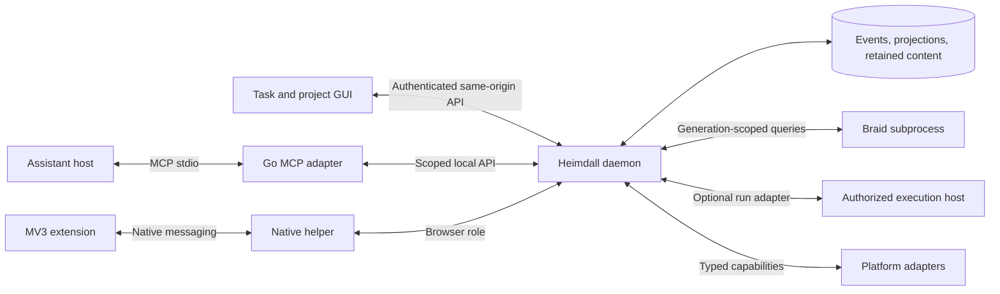

# Implementation plan: work continuity and verified progress

Updated 2026-09-05. Status: development build 0.6.0 adds initial CLI evidence evaluation and completion revalidation to continuity and scoped MCP. The design below began from build 0.2.0 and retains later milestone requirements. See [BACKLOG.md](BACKLOG.md) for remaining gaps, [EVIDENCE-SETUP.md](EVIDENCE-SETUP.md) for the new commands, and [STATUS.md](STATUS.md) for runtime capabilities. GUI work is paused at the requested commit checkpoint. No integrations or agent runs are installed by this plan.

## 1. Outcome and scope

Implement the seven improvements discussed with the user:

1. Durable task checkpoints.
2. Earlier MCP integration.
3. Verified computer actions.
4. Evidence-based completion.
5. Durable continuation through an optional execution host.
6. Project-aware memory using Braid.
7. A GUI for inspecting and steering work.

Acceptance scenario: interrupt a multi-step task after a real side effect but before its acknowledgement, restart the components, recover the accepted objective and last checkpoint, inspect the actual environment, and resume only the unfinished work. Preserve uncertain outcomes rather than repeat them. Completion requires current evidence or explicit user attestation. A missing runner, unavailable browser, stale index, or absent provider must produce a visible limited capability, not invented progress.

Keep Go for the daemon, event store, CLI, native helper, MCP adapter, checks, retrieval adapter and run coordinator. Use TypeScript for the growing extension and web GUI. Braid stays a separate retrieval engine. The daemon owns application state; browser storage is a transport cache; MCP exposes capabilities; the execution host runs agent work.

This plan does not require completing mail, every conversation adapter, Linux desktop restoration, or the full ranked planner before checkpoints become useful. Those existing roadmap items remain open and retain their original acceptance gates.

## 2. Baseline and changes to the previous roadmap

| Area | Existing implementation | Required extension |
|---|---|---|
| Tasks | Task/step hierarchy, revisions, completion text/check definitions, next action | Explicit accepted task contract, resource bindings, immutable checkpoints |
| Store | SQLite schema marker 2, one writer, event transactions, JSON projection, replay | New validated event families, schema migrations, durable operation/run records |
| Authorization | CLI credential plus separate browser-ingress credential; HTTP commands attributed to `cli` | Authenticated principals, scoped grants, role-specific routes and field-level mutation policy |
| Browser | Paired inventory, epochs, managed-tab commands, session journal, native bridge | Fresh observations, expected outcomes, reconciliation and separately recorded verification |
| Completion | Manual completion and aggregate proposals; many source kinds unsupported | Version-bound evidence, invalidation, evaluator registry, review of evidence-based proposals |
| Retrieval | Implemented Braid subprocess; proposed consumer contract | Isolated generation publication, project context assembly, evaluation with real workstream labels |
| UI | Extension connection/pause/pairing popup | Daemon-served project/task view, checkpoint/evidence inspection, review and run controls |
| Agents | No runner adapter or automatic execution | Checkpoint handoff first; opt-in dispatch/recovery only after an actual host capability test |

The [v1.1 spec](design/HANDOFF-heimdall-v1.1.md) currently places MCP and the GUI in M4 and excludes running implementation agents in §1. Proposed amendments are:

- Move read-only MCP and the first GUI into the early continuity slices.
- Extend agent support to an optional coordinator that requests work from an independently installed, authorized execution host. Heimdall does not implement a model loop or assume it can wake an arbitrary chat.
- Keep observations, model suggestions, and human approval distinct. A model-originated MCP call is not user ratification. Scoped authorization can permit routine work without repeating approval for each step.
- Add checkpoint, contract, evidence, decision, action-verification, grant and run schemas at their first consuming milestone.
- Add a platform capability interface. Use the existing Chromium integration first. Preserve Linux/Hyprland as the target desktop; Windows remains the immediate core/browser verification environment. Windows accessibility control requires a separate adapter and acceptance gate.

Do not silently rewrite the existing spec as though optional execution had already shipped. Update its relevant sections when adopting each implementation slice; use this plan for the proposed sequence and [BACKLOG.md](BACKLOG.md) for work items.

## 3. Runtime and package boundaries

Keep the existing `internal/core`, `internal/store`, `internal/browser`, `internal/daemon`, and `internal/nativebridge` packages. Add focused packages as their slices land; avoid a preliminary repository-wide refactor:

| Proposed package/path | Responsibility |
|---|---|
| `internal/model/{contract,checkpoint,resource,evidence,run}.go` | Domain types and versioned payload validation |
| `internal/authz/` | Principals, grants, target/revision policy and revocation |
| `internal/continuity/` | Checkpoint commands and deterministic resume-context assembly |
| `internal/checks/` | Typed evidence evaluation and invalidation |
| `internal/actions/` | Request/attempt/observation/verification lifecycle shared by adapters |
| `internal/runs/` | Dispatch outbox, ownership, leases, recovery and limits |
| `internal/runner/` | Host interface, deterministic fake host, then one verified real adapter |
| `internal/retrieval/` | Braid supervisor, permitted snapshots, generation lifecycle, context selection |
| `internal/mcp/` | Protocol mapping to the daemon; no direct database writes |
| `internal/daemon/` additions | Scoped API, bounded event feed, UI bootstrap/session |
| `web/` | TypeScript GUI, build assets embedded through a Go package |
| `protocol/` | Versioned JSON Schemas, generated TypeScript types and shared fixtures |

Use the official [Go MCP SDK](https://go.sdk.modelcontextprotocol.io/) for the first adapter. Pin a tested release and protocol revision at implementation time, recording license and host compatibility. Do not add a second hand-written MCP protocol stack. Long operations return Heimdall operation IDs with ordinary status tools initially. MCP Tasks can be an optional negotiated adapter later: [the extension requires client/server support](https://modelcontextprotocol.io/extensions/tasks/overview). Its wire lifecycle must not define Heimdall's domain task lifecycle.

## 4. Domain contract and shared invariants

Task, checkpoint, execution attempt and browser operation are different identities. Keep task IDs and `task#step` references compatible with the existing model. Allocate new object IDs with the existing opaque random-ID convention. Do not assign task meaning to timestamps, browser tab IDs, host session IDs or retrieval ranks.

| Record | Minimum fields and rules |
|---|---|
| Task contract | Target, contract revision, objective, accepted constraints, acceptance-check references, resource-scope references, accepted actor/event. Initial objective and checks derive from the current task; edits require explicit authority. |
| Checkpoint | ID, schema version, target/task revision, contract revision, previous checkpoint ID, run/attempt ID if any, recorded event boundary, current step, progress summary, next action, blockers, resource versions, evidence/decision references, author/source. Append-only; newest is not automatically authoritative. |
| Resource binding | Logical ID, canonical repo/root or source identity, type, task/project membership, observed instance when relevant, version/digest, provenance and access scope. Root registration is separate from access grants. |
| Decision | ID, target, text, status (`proposed`, `accepted`, `superseded`, `rejected`), provenance, supersedes link and accepting event. An assistant summary cannot overwrite an accepted decision. |
| Evidence | ID, check/target/contract references, subject version, observer identity, source class, observation time, received event, evaluator version, content/output digests, outcome and coverage. Self-reported agent success is a claim, not verified test execution. |
| Action | Logical operation ID, principal/grant, adapter capability, exact target, preconditions, expected outcome, expiry, attempt IDs, result observations and verification status. External calls occur after durable request commit. |
| Run / attempt | Target and contract revision, checkpoint/context boundary, host identity/job ID, dispatch key, status, grant, owner/fencing generation, lease information, limits, wake condition, outcome and checkpoint references. A successful attempt does not itself complete the task. |
| Grant | Principal, target/subtree, allowed verbs, resource scopes, purpose, limits, expiry/revocation, and originating user authorization. Credential material stays outside events and context bundles. |

Store large text, screenshots, command output and artifacts as retained content with digests and references. Start with a 64 KiB structured checkpoint limit and 16 KiB progress-summary limit; these are implementation defaults to validate in fixtures, not a promised context-window size. Reject excess explicitly or require a retained-content reference. No silent truncation of constraints or acceptance criteria.

Reuse the existing event envelope initially, with versioned payloads and explicit causation references inside new payloads. Add typed events such as `contract.accepted`, `checkpoint.recorded`, `resource.bound`, `decision.accepted`, `evidence.recorded`, `evidence.invalidated`, `action.verified`, `grant.revoked`, and `run.state_changed`. Specify each payload before enabling its writer. Replay applies recorded facts and never queries tools, invokes an evaluator, dispatches a job, schedules a fresh attempt or reconstructs the desktop.

Migration starts from the current schema marker 2. Freeze the next marker and upgrade fixture in the first schema patch; never reuse a released marker for a changed persisted contract. Retain old events and map legacy browser `succeeded` to API-reported success with verification unknown, not retrospectively verified success. Keep `tasks.yaml` readable: checkpoints, run histories and evidence live outside the task edit view. Existing workflow statuses remain independent of run states.

## 5. Improvement 1: durable task checkpoints

Deliver a usable manual/CLI checkpoint path before integrating any agent host.

- Register task resources and explicitly accepted contract/decision records. Use existing parent tasks as the initial project boundary; do not add a competing project hierarchy.
- Add checkpoint create/get/list and resume-context commands. A checkpoint names the prior checkpoint; reject competing advancement unless the caller explicitly records an alternate branch. Stale task revisions remain historical and cannot silently become the current resume checkpoint.
- On resume, load the current task, ancestor constraints, contract, accepted decisions, latest compatible checkpoint, blockers and uncertain operations directly from authoritative state. Retrieval is optional supplementary material.
- Validate live resource versions before claiming the checkpoint is still applicable. If the checkout, worktree, referenced file or browser epoch changed, retain the checkpoint and attach a specific mismatch. Do not discard history or infer an automatic merge.
- Record summaries as source-attributed assertions. Persist decisions and evidence independently so a short summary cannot erase them.

Proposed CLI: `checkpoint create TARGET --file FILE --expected-checkpoint ID`, `checkpoint show ID`, `checkpoint list TARGET`, and `context TARGET --budget N`. Creation uses an explicit sentinel for the first checkpoint. These names are planned API, not current executable commands.

Acceptance: two competing checkpoint updates cannot both advance the head; retries preserve identity; crash/replay preserves the checkpoint chain; stale contracts and changed worktrees are surfaced; missing optional retrieval does not prevent a complete minimal resume context. An oversized required context returns `budget_too_small` with the required estimate instead of omitting governing constraints.

## 6. Improvement 2: earlier MCP integration and authorization

Current `/commands` forwards requests using actor `cli`, and the CLI credential can read all state. Do not give that credential to an MCP adapter or expose `/commands` as an unrestricted generic tool.

Introduce server-derived principals and a scoped local API shared by CLI, MCP and the future GUI. A stdio MCP process proxies to the existing daemon; it does not call `core.Open` or become a second writer. Establish a per-client credential through local setup. The adapter cannot broaden its own grant.

Initial tools:

| Tool family | Slice | Authority |
|---|---|---|
| `heimdall_task_get`, `heimdall_context_get`, `heimdall_checkpoint_list`, `heimdall_capabilities` | Read-only MCP | Scope-filtered read |
| `heimdall_checkpoint_record`, `heimdall_progress_record` | Checkpoint writes | Granted target; cannot revise accepted objective/constraints |
| `heimdall_action_request`, `heimdall_operation_get` | Verified actions | Explicit allowed action/target/resource grant |
| `heimdall_evidence_submit`, `heimdall_completion_propose` | Evidence | Append claim/proposal; no implicit ratification |
| `heimdall_run_get`, `heimdall_run_resume`, `heimdall_run_pause`, `heimdall_run_cancel` | Continuation | Scoped run authority; resume cannot expand its grant |
| `heimdall_context_search` | Braid integration | Permitted snapshot only; optional cross-project scope |

Mutation envelopes include request ID, expected relevant revisions and grant reference. The daemon derives the actor from the authenticated channel; caller-supplied actor, workspace root or approval fields cannot elevate it. Every read—including event cursors, operation lookup, errors and search explanations—must respect scope.

A user can authorize a bounded class of routine work once, with that authorization surviving reconnection. A task contract edit, new resource scope or separately restricted action is checked against the grant; an actual scope expansion requires an explicit user decision. Existing authorization is reused rather than repeatedly requested. MCP annotations describe tool behavior but are not the enforcement layer; the [protocol schema treats them as hints](https://modelcontextprotocol.io/specification/2025-11-25/schema).

Acceptance: stdio sessions work with a second process while the daemon holds the writer lock; reconnect restores access only within the grant; wrong-project reads, forged approval fields, revoked grants and unauthorized completion are denied; request IDs survive retries; incompatible protocol/SDK versions fail with useful diagnostics. Complete a real host connection test before advertising that host as supported.

## 7. Improvement 3: verified computer actions

Preserve the extension's epoch/ownership/URL protections, outbox and interrupted-operation journal. Add a shared action service above browser and future platform adapters.

Separate execution from verification:

- Execution: `queued`, `dispatching`, `api_reported`, `refused`, `uncertain` or `cancelled`.
- Verification: `pending`, `matched`, `not_matched`, `unknown` or `unsupported`.

An action can be API-reported while its expected outcome is still pending or unknown. Repeated observations can settle verification; this does not cause a fresh execution attempt. A late outcome is retained without erasing the earlier uncertainty.

Start with browser outcomes: a created owned instance exists; navigation reached an allowed expected URL and requested load condition; a tab is active in a focused window; membership changed to the requested window; or the exact owned instance is absent after closure. Redirect policy is explicit. Never equate a closed view with saved application data. A close blocked by a page or an observation gap must not count as verified closure.

Request a fresh snapshot before destructive/membership-sensitive operations. Initial maximum observation age is five seconds, bounded by the existing operation deadline and measured by daemon receipt time. Revalidate ownership and URL again at the adapter immediately before acting. Use monotonic elapsed time within a process; after restart require fresh observations. Snapshot checks cannot make unrelated external UI actions atomic, so postconditions remain necessary.

Capability order: purpose-built application API, browser semantic API/approved site adapter, native accessibility adapter, then explicit visual interaction where supported. Advertise capability and verification coverage separately. Do not turn unsupported semantic actions into blind coordinate clicks. General DOM/content access remains behind the existing site permission and source-format gates.

Acceptance: duplicate URLs, changed focus, stale epochs, navigation races, redirects, before-unload refusal, browser disconnect, lost result acknowledgement and daemon restart. A successful browser call with a failed postcondition stays unverified. A recovered command observes its old outcome before any retry. Register the real Chrome/Edge native host in a dedicated acceptance profile before claiming deployment support; retain Linux/Hyprland and Windows accessibility as separate platform gates.

## 8. Improvement 4: completion evidence

Build on existing typed checks, proposals and manual attestation. Add an evaluator registry with explicit input versions and coverage. First useful evaluators are artifact digest/existence, configured test execution, and repository state predicates. Existing mail and provider-specific kinds keep reporting unsupported until their adapters land.

A configured test definition is an argv array plus registered working directory, environment policy, timeout and output cap. It is authorized executable work, not arbitrary shell text extracted from a checkpoint. Record command-definition digest, actual worktree/commit and dirty-input manifest, start/end state, exit status, runner identity and output digests. If relevant inputs mutate during or after execution, that evidence cannot prove the current target satisfies its check. A commit SHA alone is insufficient for a dirty worktree.

Define input coverage per check: a conservative registered workspace manifest initially, with exclusions for generated output and secrets. Narrow dependency manifests only when a trusted build adapter supplies them. Missing coverage yields unknown. A file existing proves existence; semantic content quality needs an appropriate validator or user review.

Contract revisions and evidence dependency changes invalidate affected evaluations and supersede pending completion proposals. Acceptance rechecks current contract, task/step state, evidence versions, dependency state and conflicts in one transaction. Previously user-accepted completed work retains its history; later contradictory evidence creates a visible review need rather than silently rewriting the past. Parent completion continues through the existing proposal mechanism.

Acceptance: a report from another repo, stale passing tests, changed uncommitted files, edited criteria, missing artifact, partial coverage, forged agent result and a stopped agent cannot silently complete a task. Manual attestation remains available with explicit provenance. Replay returns the recorded evaluation outcome without rerunning a test.

## 9. Improvement 5: durable continuation

Implement a manual handoff/resume bundle and deterministic fake runner first. Then enable one real host only after proving its supported start/attach/status/cancel interface. Codex-compatible continuation is a candidate because it is the current collaboration environment; an externally callable interface and its actual capabilities must be verified. Do not assume desktop task tools are daemon APIs, scrape private host state, inject prompts through the GUI, or invent a resume endpoint.

Proposed adapter contract: `Capabilities`, `Start(dispatch_key, context_ref, grant, limits)`, `Lookup(dispatch_key/job_id)`, `Status`, and `Cancel`. `Attach`/`Resume` are optional capabilities. A host without attachment can start a new attempt from a compatible checkpoint only after the prior attempt is confirmed stopped and its effects reconciled.

Run state: `queued → starting → running → waiting_external | needs_user | paused | verifying → succeeded | failed | cancelled`. Record `recovering`/`uncertain` explicitly when host state is missing; allow only documented transitions. A run's `succeeded` means its assigned attempt met its run contract, not automatic task completion. Cancellation is first a requested event and becomes terminal only when the host confirms the relevant work stopped; partial output remains inspectable.

Persist dispatch intent and an idempotency key before host invocation. If the host supports key lookup, reconnect to the job after a lost acknowledgement. If it cannot establish whether a launch happened, mark uncertain and require reconciliation; do not launch another worker merely because a lease expired.

Use a transactional per-target lease and monotonically increasing ownership generation. Initial heartbeat interval: 10 seconds; lease expiry: 60 seconds; values live in validated configuration. Fence obsolete attempts from new Heimdall actions and checkpoint advancement. This does not stop an old external process writing files: serialize write-capable runs by canonical worktree/resource lock, confirm host termination before takeover, and keep the resource quarantined when termination is uncertain. Cooperative metadata fencing is not a filesystem sandbox.

Record each run's user-configured time/attempt limits, optional cost/token limits when the host reports them, permitted resources and wake conditions. Do not claim token enforcement for a host that cannot measure or enforce it. Unknown host availability stops dispatch. Unchanged failures use bounded backoff and a retry ceiling; context changes or explicit intervention may create a new attempt. Wake only for a satisfied dependency, due authorized schedule, external result or explicit resume. Repeated sensor refreshes do not create repeated runs or notifications.

Acceptance: daemon and host crashes before/after job creation; lost acknowledgement; disconnected host; clock change; lease contention; late heartbeat from old owner; cancellation race; grant revocation; unavailable model/provider; resource-lock collision; repeated identical failure; limit exhaustion. No takeover with an uncertain old writer. A cold daemon restart schedules recovery but replay itself launches nothing. A fake runner demonstrates the state machine; a real adapter requires its own compatibility/recovery evidence before release.

## 10. Improvement 6: project-aware memory through Braid

Implement the [existing Braid contract](design/BRAID-CONTRACT.md) with current source verification before integration. Do not add a second retrieval engine or depend on unimplemented delete/attribute-filter APIs.

Load mandatory context directly from Heimdall at event boundary H: accepted contract and inherited constraints, current task/step, checkpoint, blockers, accepted decisions, grants represented as capabilities rather than secrets, and outstanding uncertain actions. Optional retrieval receives only the remaining context budget. Report incomplete optional context explicitly; never silently omit mandatory constraints to fit a budget.

Extend the mapping with accepted decision, checkpoint summary, evidence summary and resource nodes. Copy only accepted relationships, including explicit dependencies between workstreams. Tag source, revision, content digest, supersession and scope. Searchable text remains untrusted evidence; it cannot modify the task contract or grant authority.

Braid has lexical, dense, graph and temporal channels. Keep them configurable, and measure combinations rather than require equal weights or all four for every query. Graph relationships connect known dependencies; semantic similarity proposes candidates; recency suggests freshness but does not establish authority. Dense requires explicit provider configuration/reindex and disclosure scope. Lexical/graph/temporal operation must work when embeddings are unavailable.

Scope must be enforced before candidate retrieval. The current Braid filters cannot express arbitrary project/account authorization, so build separate permitted-scope generations. Default scope is the active project. A declared dependency or explicit broader query can select an authorized union generation; post-filtering a global result is insufficient because ranking/explanations can leak excluded sources. Bound the scope-generation cache and report index_pending instead of spawning unbounded rebuilds.

Publish immutable generations only after mapping, all batches and optional vector indexing finish; store H and manifest digests. For membership-sensitive use, require current scope and revision compatibility. On revocation/purge, deny affected old-generation reads immediately, then rebuild; do not keep serving sensitive stale output while rebuilding. Distinguish current-state context from permitted historical research. `query.at` only fixes recency and is not a historical snapshot.

Evaluate on consented, labeled real workstreams, split by conversation/artifact lineage to prevent leakage. Questions cover resumption, decision rationale, cross-project impact and remaining acceptance requirements. Compare lexical; lexical+dense; lexical+graph+temporal; and all four, plus channel-removal ablations where useful. Track relevant-evidence recall@k, unsupported/superseded and wrong-workstream results, abstention, context cost, latency and index-build cost. Establish numerical quality targets after baseline measurement; scope leakage and presenting superseded decisions as current are correctness failures, not acceptable ranking tradeoffs.

Acceptance: Braid unavailable, missing embeddings, partial generation build, removed graph edge, revoked source, stale membership, wrong-project query, budget overflow and repeated near-duplicate artifacts. Core context still works without Braid. Retrieval scores never become probabilities or completion proof.

## 11. Improvement 7: GUI for work inspection and control

Build a local web UI served by the daemon, using TypeScript and embedded assets. Keep the extension popup small: connection, pairing, pause and a link to the main interface. The first GUI release does not depend on the full ranked planner or a running agent.

Deliver three views incrementally:

1. Task/project view: objective, next action, parent/step dependencies, compatible checkpoint, blockers and capability gaps. Use current importance/due/status information; label sorting honestly until the specified planner exists.
2. Evidence/review view: accepted versus proposed decisions, changed criteria, artifact/test evidence, uncertain actions, and completion proposals with current revisions.
3. Run view: active attempt, host status, last heartbeat/checkpoint, limits, waiting condition, pause/cancel/resume and recovery explanation. Hide or disable unsupported controls with a reason.

The task page assembles directly loaded core context and optional retrieved material visibly separately. User-facing labels describe work; raw IDs and protocol diagnostics belong in expandable details. Display API success and verified result separately. Keyboard navigation, accessible status changes, readable layouts and copyable failure details are release criteria.

The existing HTTP handler rejects all Origin headers and expects bearer tokens; serving HTML alone is not a working authenticated GUI. Add a distinct same-origin UI session route. Proposed local bootstrap: `heimdall ui` creates a short-lived single-use code, opens a token-free loopback page, and prints the code for entry. The POST exchange creates an HttpOnly SameSite=Strict session bound to the daemon instance. Codes, session credentials and API tokens stay out of URLs, logs and browser persistent storage. Define session expiry/revocation, Host/Origin checks, CSRF protection and restrictive CSP before enabling mutations. Render captured text as text, not executable HTML.

Add a bounded, scope-filtered event feed with resumable cursor. A stale or out-of-scope cursor returns resync-required and a fresh scoped snapshot; it never falls back to unfiltered `/events`. Persist domain notifications and snooze/dismiss state when run controls arrive; refreshes should not repeatedly notify about the same blocker.

Acceptance: empty project, disconnected sensor, stale checkpoint, unavailable retrieval, uncertain action, stale completion proposal, paused run and host unavailable. Test keyboard interaction, narrow/wide viewports, malicious captured text, forbidden cross-origin requests, session expiry and reconnect without duplicate events. Run controls show the actual confirmed state after the request.

## 12. Delivery sequence

Each slice must be useful and reviewable independently. Estimates are relative risk, not calendar commitments.

| Slice | Deliverable | Dependencies | Risk / release gate |
|---|---|---|---|
| S0 | Freeze schemas, auth model, migration strategy and host/platform capability ledger | Current build | Medium; actual core/browser baseline checks and legacy fixture |
| S1 | Contract/resource binding, checkpoints, deterministic minimal context via CLI | S0 | Medium; conflicting checkpoint, changed-resource and replay tests |
| S2 | Scoped read-only MCP and checkpoint/progress tools | S0, S1 | Medium; real MCP client connection and role isolation |
| S3 | Version-bound evidence and completion review | S1, auth from S2 | Medium; stale/forged/partial evidence negatives |
| S4 | Read-only task/checkpoint/evidence GUI, then scoped review commands | S1, S2, S3 for evidence review | Medium; local session and browser UI acceptance |
| S5 | Browser postcondition verification and action reconciliation | S0, S2 | High; actual native-host and browser failure scenarios |
| S6 | Scoped Braid generations and context bundles with evaluated retrieval | S1, S2, resource/evidence schema | Medium–high; isolated scope, rebuild/revocation and real-label evaluation |
| S7 | Run state machine, fake runner, manual handoff, limits and run GUI | S1–S5; S6 optional | High; deterministic fault-injection suite |
| S8 | One supported execution-host adapter and full restart/resume demonstration | S7 and verified real host contract | High; external job reconciliation and no uncertain writer takeover |

S5 and S6 can proceed independently after their dependencies. S4 starts as an inspection interface before action/run controls. No need to wait for all retrieval channels, conversation ingestion or desktop parity to use S1–S4. Browser semantic verification does not certify a future native accessibility adapter.

## 13. Operational prerequisites and validation

- Extend configuration only for the features above: client roles/grants, registered roots, evidence definitions, run limits, adapter capabilities, retrieval scopes and UI sessions. Preserve existing `--data-dir` behavior; broad XDG/catalog/timezone work is not a hidden prerequisite. Test all newly introduced timing with an injected clock and process-epoch handling.
- Add a consistent backup/export path before migrating a real user database. Exclude secrets by default; document retained-content loss and prohibit downgrade by editing the schema marker. Test upgrade from a real schema-2 fixture, rollback using a stopped-data backup, and refusal of unknown versions.
- Replace unbounded history reads in new interfaces with scoped pagination/cursors. Keep full replay/export as explicit local operations. Introduce operational tables or per-entity projections when necessary; benchmark the current whole-state JSON path as browser/run histories grow.
- Generate shared wire types from versioned schemas; add Go/TypeScript conformance fixtures. Convert the extension to TypeScript without changing manifest identity or wire behavior in that patch. Pin build dependencies and preserve reproducible extension packaging.
- Maintain compatibility evidence per daemon/schema, extension/protocol, MCP SDK/client, Braid binary/provider, OS and runner version. Existing smoke tests remain regression gates. Only run broader suites when a slice changes the relevant behavior.
- Track checkpoint/context latency, serialized state growth, event throughput, retrieval build cost and bounded queue behavior on representative fixtures. Decide scale-triggered storage changes from measurements; do not claim performance targets without a baseline.

Release evidence for each slice: scope and deviations, schemas/migration, meaningful automated checks, actual integration results where applicable, failure/recovery demonstration, setup/upgrade notes and updated STATUS. Update the backlog with completion evidence rather than using checkboxes as proof.

## 14. Decisions left to capability spikes

| Decision | Working default | What resolves it / when it blocks |
|---|---|---|
| First execution host | Manual handoff + fake runner; evaluate a Codex-compatible documented host first | Prove dispatch-key reconciliation, status, cancellation and permission boundaries before S8. Does not block S1–S7. |
| First native desktop adapter | Linux/Hyprland per existing spec; Windows core/browser tests continue | Actual desktop target access before that adapter's acceptance. Does not block browser verification. |
| GUI framework/build tooling | TypeScript browser UI with embedded assets; select a small accessible component approach | Pin build dependencies in S4 after route/session contracts. No desktop wrapper dependency initially. |
| Automatic completion policy | Existing explicit acceptance/manual attestation; agents submit proposals | Any broader automatic completion policy is a separately recorded user decision, not inferred from enabling a runner. |
| Dense retrieval provider | Off until configured; use Braid's existing provider contract | Model/provider and permitted content scope before dense indexing. Does not block core or non-dense retrieval. |
| Dataset retention/scale | Retain provenance; separate purgeable content and bounded transport/operational records | Measure real input volume and confirm source retention during setup before broad content ingestion. |

The first implementable increment is S0–S1: typed contracts and checkpoint events, schema-2 upgrade/replay fixtures, resource-version checks, CLI checkpoint creation and a deterministic resume-context command. It delivers continuity without depending on a particular model host or rewriting Braid.
