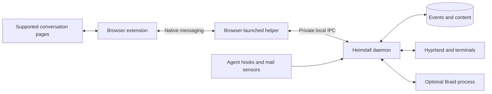

# Browser extension: runtime and deployment specification

Design baseline, 2026-09-04. Complements §7–8 of the [Heimdall spec](HANDOFF-heimdall-v1.1.md). The metadata/control subset is implemented in build 0.2.0. See [implemented protocol](../BROWSER-PROTOCOL.md), [setup](../BROWSER-SETUP.md), and [verification](../VERIFICATION.md). This document still describes the broader target, including unimplemented content adapters, chunk assembly, private Unix IPC, and Hyprland integration. No normal user-profile extension or native registration has been installed.

## 1. Runtime boundary

**Run the extension and daemon together.** The extension is Heimdall's browser sensor, browser actuator, and optional browser UI. The daemon remains the durable application and desktop controller. Moving the UI into an extension does not move storage, task logic, retrieval, or OS integrations into it.



| Component | Owns | Lifetime |
|---|---|---|
| Content scripts | Read permitted conversation content; detect settled revisions/artifacts; report source evidence | Associated with supported open pages |
| Extension service worker | Tab/window inventory and focus, message validation, reconnect/outbox, allowed browser commands | Browser-managed; reconstructible after restart |
| Extension popup/options | Connection health, source permissions, pause/resume, optional explicit capture | Opened by the user; closing it does not stop capture |
| Native helper | Protocol framing and forwarding to daemon IPC | Browser launches it for a native connection; no independent service |
| Heimdall daemon | Event log, task state, summaries, evidence matching, proposals, planning, notifications, OS actions | User service started at login; useful with browser closed |
| Braid | Optional retrieval index and queries | Managed by daemon when retrieval is configured |

The native helper is an entry point of the installed Heimdall application, not a second task engine. Linux packaging supplies a tiny fixed launcher that invokes the same executable as `heimdall browser-host`, preserving native-host arguments. A browser may launch a helper for each connected profile. All helpers connect to the same per-user daemon; none opens its database directly.

Chrome starts registered native hosts as separate processes and communicates over framed stdin/stdout. The host manifest specifies an executable path rather than a command with subcommand arguments; this is why the launcher is needed. Use `runtime.connectNative` through the service worker, not a localhost fetch from each website. [Native messaging](https://developer.chrome.com/docs/extensions/develop/concepts/native-messaging)

Manifest V3 workers are not a general replacement for a desktop service. An active native connection can keep the worker alive, but crashes, extension updates, and browser shutdown still require recovery. Store necessary state outside worker globals; never depend on an immortal JavaScript process. [Worker lifecycle](https://developer.chrome.com/docs/extensions/develop/concepts/service-workers/lifecycle)

## 2. What goes into the first extension

Package ordinary JavaScript modules and static HTML/CSS; no browser-side model runtime or framework dependency is required initially.

```text
extension/
  manifest.json
  background/        inventory, transport, command handler, outbox
  content/           shared conversation observation helpers
  adapters/          claude-ai and chatgpt, versioned separately in source
  ui/                popup, setup/options, nonce pairing page
  protocol/          message schemas and fixtures
  tests/             redacted adapter pages, worker/reconnect tests
```

Browser functions: tab/window create, navigation, activation, move, and removal; observe tab lifecycle and window focus. These use the browser's APIs, not title scraping. Browser IDs still require separate pairing to Hyprland window addresses. [Tabs API](https://developer.chrome.com/docs/extensions/reference/api/tabs), [Windows API](https://developer.chrome.com/docs/extensions/reference/api/windows)

Automatic content capture is separate from metadata inventory. On enabled Claude.ai/ChatGPT pages, a site adapter emits a complete or explicitly partial conversation revision while the page exists. It must handle settled responses, edited/branched messages, artifacts, navigation, and schema drift. It does not promise arbitrary website capture or access to native desktop chats. The source-format spike chooses an available interface; private backend JSON is not assumed stable or guaranteed accessible.

Initial UI is intentionally small: connected/disconnected state, last acknowledged capture, enabled source list, content pause, and explicit capture. A side panel for task/proposal review can follow later; it must submit the same daemon commands as the CLI. The initial extension observation channel has no authority to ratify proposals. Adding task-mutating extension UI requires a separately specified UI command capability, inaccessible to content scripts.

## 3. Permissions and source scope

Proposed baseline permissions: `nativeMessaging`, `tabs`, `storage`, `alarms`, and `scripting`. `tabs` enables inventory metadata; it is not blanket page-content permission. Request optional host permissions during source setup for `https://claude.ai/*` and `https://chatgpt.com/*`, then register packaged content scripts only for granted sites. Automatic capture must not rely solely on `activeTab`, which grants temporary access following user invocation. [Tabs permissions](https://developer.chrome.com/docs/extensions/reference/api/tabs), [permission declarations](https://developer.chrome.com/docs/extensions/develop/concepts/declare-permissions)

No default all-sites content access, cookies permission, debugger permission, broad network interception, clipboard monitoring, or private-browsing capture. Users can pause individual sources. Browser metadata scope and conversation-content scope are shown separately during setup. Revocation stops observation and clears unacknowledged content from that source; deletion of already-acknowledged daemon content follows the retention/purge command.

Validate content-script messages using browser-supplied sender/tab/frame metadata. Ignore caller-supplied claims of another tab or account. Page content is evidence only. It cannot emit a browser command or request native file reads. The native host registration allows exact release/development extension IDs, not arbitrary origins. Pair each profile through the local setup flow; a profile ID identifies a source but is not itself an authentication secret.

## 4. Connection and recovery contract

Protocol major version 1. Schemas, serialization fixtures, and fake-peer tests are required before either side's implementation. Message families:

| Message | Direction | Required behavior |
|---|---|---|
| `hello` / `welcome` | Both | Negotiate protocol/version/capabilities, authenticated client ID, browser epoch and acknowledged cursor |
| `inventory` | Extension → daemon | Reconcile current tab/window bindings after connection; do not invent history during a gap |
| `observation` | Extension → daemon | Stable message ID, source sequence, observation time, native instance identity and typed payload |
| `ack` | Daemon → extension | Acknowledge only after event/content persistence; retries must deduplicate |
| `browser_command` | Daemon → extension | Operation ID, current browser epoch, exact targets/preconditions, expiry and allowlisted action |
| `command_result` | Extension → daemon | Observed success, refusal, failure, or uncertain outcome; retain operation identity |
| `health` | Both | Adapter degradation, queue overflow, missing permission, daemon unavailable, incompatible protocol |

Native frames use length-prefixed UTF-8 JSON, distinct from Braid's newline JSON. Adopt a conservative application limit of 256 KiB/frame in both directions. Chunk larger snapshots with a digest, total-size cap of 8 MiB, and bounded assembly expiry; persist/ack a snapshot only when validated and complete. These are initial product limits, not claims of browser limits. Truncated larger content explicitly reports incompleteness. [Native protocol](https://developer.chrome.com/docs/extensions/develop/concepts/native-messaging)

Persist an IndexedDB outbox, initially bounded to 32 MiB/24 hours and subject to browser storage failure. Store source IDs/cursors there; browser epoch lives in session storage so a worker restart does not create a new browser identity. Browser storage is a transport cache, not a second event log; delete content after daemon acknowledgement. Do not sync conversation data through `storage.sync`. [Extension storage](https://developer.chrome.com/docs/extensions/reference/api/storage)

Retry native connection with bounded exponential backoff and jitter; use browser alarms to recover when no worker is active. Inventory reconciliation follows handshake, then queued observations replay. An overflow records a visible gap and prioritizes a fresh snapshot instead of pretending to have a complete transcript. Daemon receipt assigns authoritative event order; source times/sequences describe observations, not command authority.

Never blindly retry ambiguous browser actions. Persist pending operation IDs before executing. After restart, reconcile current targets/nonce pairing evidence; an unresolved create/move/close returns uncertain. Reject commands addressing an old browser epoch, expired command, or changed ownership. Graceful browser refusal is not success.

| Failure | Expected product behavior |
|---|---|
| Browser closed | Daemon, agent hooks, mail, timers and planning continue; browser sensor offline |
| Daemon unavailable | Browser remains usable; extension buffers within limits and shows disconnected; no local task mutations |
| Worker/helper restarts | Reconnect, reload outbox, reconcile inventory and uncertain operations |
| Site adapter breaks | Metadata continues; affected content sensor reports degraded |
| Braid unavailable | Capture/planning continue; retrieval suggestions unavailable |
| Browser not running when `open` is requested | Daemon may launch a configured managed browser profile, await its handshake, then issue commands; timeout leaves the operation incomplete |

The last behavior needs a real Linux startup test. Do not assume a daemon can wake an extension in a completely closed browser through native messaging alone.

## 5. Installation and deployment

One product, two installation artifacts: a native Heimdall package and an extension package. Braid remains an optional separately versioned dependency. Users should not manually start the helper or run a second background-service command.

Development/initial personal deployment:

1. Install the native executable plus fixed helper launcher; create config/state directories and the user service through explicit Heimdall setup.
2. Load the unpacked extension in the chosen Chromium profile. Keep a stable development extension ID, distinct from release identity.
3. `heimdall init --browser` registers the native host for the detected browser and exact extension ID. Registration contains an absolute helper path and must handle nondefault browser installations explicitly.
4. In extension setup, grant the selected site permissions and pair the profile. Show a successful handshake and test observation; no recurring per-session activation.
5. `heimdall doctor` reports daemon/service, bridge, profile, extension/protocol versions, granted sources, and actual capabilities. It must distinguish “installed” from “connected and receiving data.”

General distribution: publish the extension through Chrome Web Store and distribute native packages independently. Linux-specific packaged/self-hosted extension distribution is an alternative to evaluate for omarchy; it is not a portable assumption for other desktops. Browser-specific stores/builds and Firefox/Safari support are later ports. Unpacked loading remains a development path rather than the intended mass-install experience. [Distribution overview](https://developer.chrome.com/docs/extensions/how-to/distribute), [alternative installation methods](https://developer.chrome.com/docs/extensions/how-to/distribute/install-extensions)

Native packaging installs service startup under the user account; configure graphical-session access for Hyprland without running as root. The browser starts the extension on browser startup, and the extension starts the helper connection. The daemon never exits just because that browser exits. The helper reconnects to a restarted daemon but does not independently elect itself as a daemon or start competing writers.

Extension and daemon updates can arrive independently. Negotiate supported protocol versions/capabilities, reject incompatible mutation commands, and expose an actionable mismatch. Ship source adapters inside versioned extension releases, not as remotely downloaded executable code. Native updates replace the executable/launcher/host registration safely and restart only the user service as needed; unacknowledged messages survive. Uninstall removes only Heimdall-owned integration entries and preserves daemon user data unless removal is explicitly requested. Removing the extension removes its browser-local cache but does not erase the daemon's event history.

## 6. Work to specify/test before implementation

Freeze the ownership table, message schemas, permissions, profile identity, and installation layout before implementing the browser slice. The core store/task slice can proceed independently.

First browser spike: an unpacked extension observes a tab; the native helper delivers it to a fake daemon; an acknowledgement clears the outbox; the daemon creates a nonce-titled window; Hyprland pairs it uniquely. Restart each process and repeat with two profiles and duplicate page titles. Only then add conversation content adapters, with recorded redacted fixtures and clear partial-coverage behavior.

Release acceptance: no popup click needed for configured capture; browser shutdown does not stop daemon timers; disconnected data retries once logically; stale commands cannot close unrelated windows; site permission revocation stops content capture; native and extension update mismatch is visible. These tests precede claims of unattended browser coverage.
