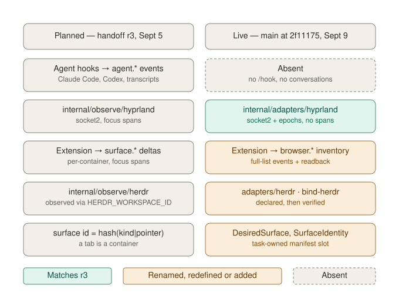
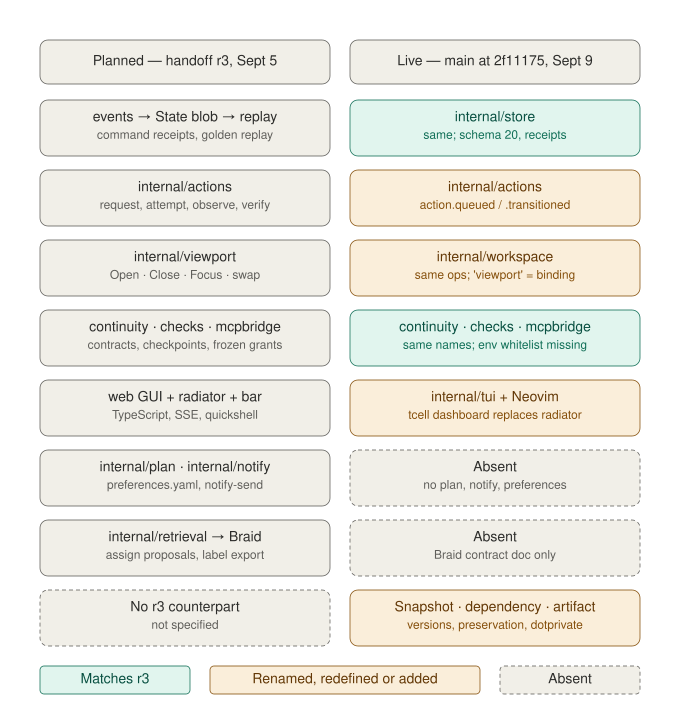

# Heimdall v1 — handoff, revision 4

Revision 4, 2026-09-09. Written against `main` at `2f11175` (Sept 9 11:48 PDT): daemon and CLI
in `cmd/heimdall`, extension 0.6.0, database schema 20, Go 1.25 / toolchain 1.27.1. External
versions verified in that tree: herdr 0.8.2 (protocol 20), Hyprland 0.56.2 with the Lua dispatch
provider, Neovim 0.12.5, Braid protocol 1, WCU at `10d4021`.

Supersedes revision 3 (2026-09-05), the v1.1 packet in `docs/design/`, `docs/history/roadmaps/IMPLEMENTATION-PLAN.md`
and `docs/history/roadmaps/REVISED-ROADMAP-IMPLEMENTATION-PLAN.md`; those remain as history. `docs/STATUS.md`,
`docs/BACKLOG.md` and `README.md` are maintained from this document. Any deviation edits this file
first, in the same PR as the code. §17 lists what changed since revision 3 and why.

Platform: omarchy (Arch, Hyprland) is the designated OS and is now the tested one. Linux tests, vet,
build, compiled continuity/evidence/MCP/resume checks, isolated Chromium native-host acceptance and
real-Hyprland workspace acceptance pass. Windows retains historical acceptance for the portable core
only; Windows and macOS desktop control return `ErrUnsupported`.

**Start here if you have not read earlier revisions.** This is the only design document you need;
the v1.1 packet, r3, `IMPLEMENTATION-PLAN.md` and `REVISED-ROADMAP-IMPLEMENTATION-PLAN.md` are
history. Read §1 (what the daemon is and is not), §3 (decisions with status), §12 (the order of
work), §14 (constraints), then Appendix B, which maps every id in the current roadmap (R5, R6,
A01, A02, W08, C14–C21, W09, and the carried-forward gaps) to a slice here or to deletion, with
replacement text. Your first PR is P0 in §12, and it includes editing those roadmap documents so
they agree with this one.

This revision is descriptive about what is built and prescriptive only about what comes next. No
built design choice is reverted: where the tree and revision 3 differ, the tree's choice is adopted
and recorded. The four changes to built code in §12 P0 are fixes carried from r3, not reversals.

How to read the status markers used throughout: **kept** (unchanged since r3), **built** (implemented
as stated), **adopted** (the tree's choice replaces r3's; r3's form is retired), **changed** (revised
by this revision), **frozen** (implemented; no expansion in v1), **absent** (specified, not
implemented, scheduled in §12). Rules in §14 are split into **binding** and **recommended**.

## 1. What Heimdall is

A local, deterministic daemon that keeps an append-only ledger of work — yours and agents' — and
turns it into three things: task state you can trust, verification of what actually happened, and a
plan for what to do next.

- It **observes** the surfaces you work in (browser, terminals, agent sessions, repos, mail) through
  sensors that record what each source can vouch for, at that source's resolution, and never
  synthesize a finer event than the source provides.
- It **records** what people and agents commit to — contracts, decisions, resource bindings,
  checkpoints, dependencies — so any later session, in any harness, resumes from accepted state.
- It **verifies** outcomes: desktop actions carry request → attempt → observation → verification with
  `uncertain` as a first-class result, and completion checks bind to evidence produced by evaluators
  that read the world, not by the actor that claims it.
- It **proposes** and the operator **ratifies**: completion, assignment, next actions, status. Nothing
  changes task state on a model's claim or a sensor's guess.
- It **acts** on the desktop only through adapters it owns (browser tabs, Hyprland workspaces and
  windows) and only on explicit command; every action is journaled and verified from a sensor.
- It **supplies context** to agents that run elsewhere: the accepted direction, last checkpoint,
  drift, blockers and the task's owned windows, through MCP and the CLI, so a harness like Claude
  Code, Codex or herdr's agent automation — and a desktop tool like WCU — can act with the task's
  scope rather than guess it. For computer use specifically, an agent registers its intent with
  Heimdall first, receives the exact window it may act on, acts through WCU, and reports each
  step; Heimdall reconciles the reports against fresh observations (§8.2).

No model and no agent runs inside Heimdall. Inference is optional and confined to three pure
functions with typed inputs and outputs: classification (via Braid), intent extraction from a
finished session, and plan rationale. Heimdall is not a harness and not an orchestrator: it does not
dispatch agents, hold leases on their work, or recover their runs. Agents are run by their own
harnesses; Heimdall records what ran, verifies what came out, and hands the next session what it
needs. The README row "persistent task continuation: dispatch, leases, recovery, execution-host
adapter" is retired by this revision (§17).

The build so far delivered the ledger, the verifier, the action journal, the workspace controller
with application recovery and verification reports, the compositor observer and a terminal UI over
them. The agent and session sensors (§7), the planner
(§10) and the notifier (§11.5) are the remaining v1 work, and they are what the ledger was built to
feed. That is the order in §12.

### 1.1 Vocabulary

Canonical r4 terms. Live names are kept; where r3 used a different word, the r3 term is given so old
documents read correctly. Three r3 words collide with live names; they are resolved by qualifiers,
not renames (Appendix A).

| Term | Means | Live alias |
|---|---|---|
| task | the unit of ranking, membership and completion; `parent` for hierarchy (depth ≤ 2); a root task is a *workstream* | same |
| step | a subtask; addressed as `task#step`; own `done.checks`, `after` prerequisites, estimate | same |
| dependency | a cross-task prerequisite edge with both endpoint revisions; cycles rejected with the hierarchy | same (`TaskDependency`) |
| target | a task id or `task#step`; the argument every continuity, evidence and MCP command takes | same |
| stream | a routing address for captures: any task id, or `unassigned` | same |
| type | a workflow template in `types.yaml`, materialized into the task at creation | same |
| surface | the family word for a thing you look at or work in; always qualified as *desired* or *observed* below | r3 used bare "surface" for the observed sense |
| desired surface | a surface a task's workspace should contain, as declared in the manifest; the `member_of` edge | `DesiredSurface`, `SurfaceIdentity`, "logical surface" (built) |
| observed surface | a surface a sensor has seen, identified by `kind` and a normalized pointer, independent of any task | `ObservedSurface` (S1); r3 "surface" |
| container | a live instance holding a surface: browser tab id, compositor window id (`native_id` + epoch), pane | `WindowIdentity`, browser tab (built) |
| session binding | a declared or observed binding of a terminal/pane container to a task, verified by herdr readback | `SessionBinding`, `session bind*`, `session.bound` (built); r3 "attachment" |
| viewport binding | a declared or observed binding of a compositor window to a task | `ViewportBinding`, `viewport.bound` (built) |
| conversation | one agent or chat transcript: started, ended, summarized; carries a transcript reference | `Conversation` (S1); r3 "session" |
| workspace | the OS-level set of containers open for a task: its Hyprland workspace, its browser windows, its herdr workspace | same |
| application recipe | a reviewed, digest-pinned way to launch, attach or detach an application for a desired surface (Foot, herdr terminal, paired browser, Neovim) | `ApplicationRecipe` (built) |
| recovery report | a fresh, scoped verification of a workspace's surfaces: settlement, existence, ownership, membership, placement, application state | `workspace verify`, `recovery` (built) |
| manifest | the versioned desired membership of a workspace; a database record, exported on demand | live `WorkspaceManifest` |
| snapshot | an immutable observed state of a workspace at a point, with policy and pins | same |
| operation | a journaled workspace command: open, focus, close, swap, reconcile, cancel | live `WorkspaceOperation` |
| action | a desktop side effect through a Heimdall adapter, journaled as request → attempt → observation → verification | same; live verbs `action.queued`, `action.transitioned` |
| check | a deterministic predicate in `done.checks`; a match proposes, never completes | same |
| contract, decision, resource, checkpoint, evaluator, evidence, grant | as in r3 §1.1; unchanged | same |
| artifact | a named, target-bound record with an opaque id; its content lives in *versions*, each carrying the exact byte digest, size, mode and Git identity of one observation; `Previous` chains versions | same (`Artifact`, `ArtifactVersion`, `ArtifactRef`) |
| content digest | sha256 of exact bytes; the key for lineage and `same_content`, distinct from artifact and version ids | `ArtifactObservation.Digest` |
| preservation | an explicit, receipted copy of selected checkpoints/artifacts into dotprivate | same |
| proposal | a machine-produced suggestion awaiting ratification: `fulfill`, `assign`, `next_action`, `status`, `reorder`, `decision`, `artifact` | same |
| sensor | an observer that emits events with idempotency keys and reports its own health | the observing half of `internal/adapters/*` |
| workspace controller | `internal/workspace`: operations, recipes, recovery | r3 "viewport"; the word viewport now means the binding above |

## 2. Planned versus live

The two diagrams compare revision 3 (left) with `main` at `2f11175` (right). Teal matches r3 by
name and semantics; amber is renamed, redefined or added; dashed is specified but absent.



The observation layer is where the substantive divergence lives. The compositor is observed. The
browser is observed, but as full inventories rather than per-container deltas, and without focus
spans. The terminal is declared (`bind-herdr` names an existing pane, then a readback confirms it is
real) rather than observed through herdr's launch-time environment. Agent state has no sensor at all:
no hook receiver, no conversations, no transcript references. Surface identity was redefined from
"content identity, independent of task" to "task-owned manifest slot".



Below the sensors the tree is closer to r3 than its names suggest. The store, continuity, evidence,
grants and MCP match. The action lifecycle is r3 §7 with different verb names. The workspace
controller is r3's viewport with the word "viewport" reassigned to bindings, and it now exceeds r3:
application recipes and recovery reports (W06, W07) have no r3 counterpart and are adopted. The TUI replaces the
browser GUI and the radiator by operator decision. Two subsystems r3 specified — the planner and the
notifier — are absent with no slice scheduled in the Sept 8 roadmap, and Braid has a contract document
but no adapter. Snapshots, dependencies, artifact versions and preservation were added without an r3
counterpart and are kept.

Net: the divergence is naming, sequencing, one word used in two senses (surface), one
declared-not-observed layer (terminal and agent), two absent subsystems, and the P0 fixes from r3
that were skipped. Nothing built is reverted; §12 resequences so the sensors come next.

## 3. Locked decisions

| Decision | Choice | Status | Rationale · rejected |
|---|---|---|---|
| Language | Go; `go 1.25`, `toolchain go1.27.1`; single static binary | built | Python; Rust |
| Determinism | no model or agent runs inside Heimdall; inference is three optional pure functions | kept, restated | overseer agent; runner subsystem |
| Store | SQLite (WAL, `synchronous=FULL`) in the data directory; one OS-locked writer | built | Postgres is scale path |
| Truth | append-only `events`; projection rebuilt by `replay`; every command records a receipt so exact retries return the stored result | built | mutable state as truth |
| Projection | one versioned JSON `State` blob plus receipt tables | built, provisional | normalize at the §15 trigger |
| Schema ledger | every marker bump adds a row to §5.1; one migration per slice is recommended (§14), not binding | changed | undocumented markers |
| Task edit surface | `tasks.yaml` with document `revision`; strict YAML; ids written back; conflicts to `tasks.pending.yaml`; `fmt` on demand | built | markdown; reformat on save |
| Task model | tree via `parent`; steps with `after`; cross-task dependencies with cycle checks; `types.yaml` materialized at creation | built | streams as a table |
| Completion | typed `done.checks`, `mode: any\|all`; deterministic proposal ids; explicit ratification; unsupported kinds report `unsupported` | built | auto-complete |
| Silence | requires an anchored `mail.received` response check; without coverage the timer yields a review reminder | built | elapsed = no reply |
| Continuity | contracts v1/v2, decisions, resources, checkpoints, mandatory context with drift; CLI-authored | built | assistant summaries as truth |
| Evidence | evaluators `artifact.exists`, `artifact.digest`, `repo.state`, `test.exit`; hermetic; digested; invalidated; revalidated before acceptance | built; env whitelist P0 | self-reported success |
| Check materialization | a check in `tasks.yaml` materializes its binding, derived contract and evaluator on save | absent, P0 | four CLI steps per check |
| Grants | expiring read grants, subtree scope, explicit checkpoint-write delegation; one action grant (intent-register, result-report) on a target's owned windows, added at S2a and then frozen again | frozen after S2a | any other kind, scope or route |
| MCP | official Go SDK stdio adapter: `heimdall_task`, `heimdall_context`, `heimdall_history`, `heimdall_checkpoint`, summary and dependencies; S3 adds `heimdall_capture` and `heimdall_observe` as typed checkpoint records under the existing checkpoint-write grant (§9.4) | built; S3 growth | hand-rolled protocol; a new grant kind or route for MCP writes |
| Sensors | hook reporters authoritative for agent state; compositor via socket2 with epochs; browser via extension and native messaging; herdr via its socket API and launch-time env; heuristic signals lower-confidence, never completion proof | compositor built; browser built (inventory); herdr partial; hooks absent | screen scraping as primary |
| Surface identity | desired surfaces (task-owned manifest members) as built; observed surfaces (`hash(kind\|normalized pointer)`, task-independent) added at S1; containers separate | built + S1 | one word for both senses |
| Actions | journaled request → attempt → observation → verification; `uncertain` preserved, never retried under a new id; verification from a sensor, not the adapter return | built (verbs renamed) | adapter return as proof |
| Workspace controller | `internal/workspace`: open, focus, close, swap, reconcile, cancel; resident capacity; pre-close snapshot and diff; nonce window association; application recipes; recovery reports | built | title matching; r3's herdr creation |
| herdr | Heimdall observes, binds and attaches (`herdr terminal attach` recipe, observed detach); it never creates herdr workspaces | adopted | Heimdall as second workspace manager |
| Execution host | none inside Heimdall; agents run in Claude Code, Codex, herdr; WCU executes desktop input for them | changed | dispatch outbox, leases, fencing, resource locks, execution limits, run state machine (roadmap C17–C20, deleted in Appendix B) |
| WCU | agent-registered intents on owned windows, per-step reports, fresh reconciliation (A01/A02) on the existing wire verbs; Desktop Observer as an accessibility-evidence source via `ActionObservation.External`; WCU's ledger and traces corroborate, never bind; Heimdall never stores frames | changed | WCU as Heimdall's window observer (Heimdall has its own); new action verbs; binding gated on WCU's uncommitted ledger |
| Sessions | source-referenced lifecycle and available native descriptions at any time (S1); purgeable evidence text; optional configured intent extraction (S3) | design adopted, unimplemented | archived transcript bodies or native claims as accepted state |
| Mail | maildir inotify first, then IMAP via `github.com/emersion/go-imap/v2`; headers only | kept, S5 | Gmail DOM; hand-rolled IMAP |
| Reference platform | Hyprland IPC; Windows/macOS desktop control return `ErrUnsupported` | built | three OSes at once |
| Event bus | none; in-process dispatch; `/events` for local consumers | kept | MQTT/NATS |
| UI | native terminal dashboard and dialogs (`internal/tui`) are the primary interface and take the radiator's role; Neovim commands; browser GUI removed | adopted | web GUI; radiator page |
| Notifications | daemon rules; delivery is an event; adapters desktop, Home Assistant, sound | kept, absent | chatbot |
| Retrieval | Braid, separate repo, `serve --stdio` protocol 1; one private database per scope; labels from ratified assignments | absent, S3 | embeddings in Heimdall |
| Names | `heimdall`; components by technical name; live names kept; colliding r3 words resolved by qualifiers (§1.1, Appendix A) | adopted | renaming built types |

Direct module allowlist (as in `go.mod`): `modernc.org/sqlite`, `gopkg.in/yaml.v3`,
`github.com/modelcontextprotocol/go-sdk` v1.7.0, `github.com/gdamore/tcell/v2`,
`github.com/rivo/uniseg`, `golang.org/x/sys`. Planned: `github.com/emersion/go-imap/v2` at S5.
CDP is not used; if adopted, `github.com/coder/websocket`. Nothing else without editing this list.

## 4. Repository layout

As built at `2f11175`. Keep the packages; add the planned ones at the slice that needs them; no
repository-wide refactor. Renames from Appendix A are type and CLI renames inside existing packages.

```
cmd/heimdall/            main and subcommands: action artifact assign backup browser capture checkpoint
                         checks client complete context contract dependency evidence grant import-tasks
                         export-tasks init ls mcp preservation progress ratify replay resource resume
                         session sync tick tui update workspace application recovery fmt doctor
internal/model/          Task, Step, Check, Document, Workflow, State; continuity, evidence, grant,
                         browser, action, workspace, snapshot, dependency, artifact, preservation types
internal/store/          sqlite, events, projection blob, receipts, replay, backups, migrations (20)
internal/core/           Engine: task commands, tasks.yaml watch/publish, captures, timers, proposals
internal/continuity/     contracts, decisions, resources, checkpoints, context, resume, progress
internal/checks/         evaluator acceptance, async attempts, evaluators, invalidation
internal/authz/          principals, grants, scope checks                             (frozen)
internal/actions/        action journal: intents, attempts, observations, verification, sweeps
internal/workspace/      manifests, snapshots, previews, operations (open/focus/close/swap), bindings,
                         application recipes, recovery reports
internal/adapters/       hyprland/ (observer + dispatcher), herdr/ (observe, bind, refresh, publish),
                         application/ (Foot, herdr terminal, browser, Neovim recipes), dotprivate/
internal/browser/        pairing, inventory, operation queue, readback verification, nonce association
internal/nativebridge/   native messaging helper
internal/mcpbridge/      MCP stdio adapter over the scoped client
internal/client/         scoped HTTP client used by mcp and client subcommands
internal/daemon/         loopback HTTP; route families in §11.2
internal/tui/            tcell dashboard and review dialogs
internal/testdesktop/    Hyprland/GTK fixtures for compiled acceptance
extension/               MV3 worker, controller, outbox, popup (0.6.0); native host dev.heimdall.browser
contrib/ (nvim)          Neovim commands
schemas/ testdata/ scripts/ docs/
```

Planned, with the slice that adds each:

```
internal/surface/        pointer normalization, kind derivation, container ids            (S1)
internal/adapters/hooks/ Claude Code (S1) and Codex (S5) hook receivers
internal/conversation/   conversation records, transcript refs, end pipeline, summaries    (S1)
internal/adapters/wcu/   outcome ingestion; Desktop Observer accessibility evidence        (S2a)
internal/retrieval/      Braid supervisor, snapshot publication, label export              (S3)
internal/infer/          Provider; intent extraction, rationale                            (S3)
internal/plan/           scoring, hierarchy, dependency exclusion, plan assembly           (S4)
internal/notify/         rules, notification events, adapters                              (S4)
internal/adapters/mail/  maildir, then IMAP                                               (S5)
contrib/                 systemd unit, hook scripts, hyprland rules, mcp config snippet    (S1–S5)
```

## 5. Data model

### 5.1 Event log (as built)

```
events(id, event_version=1, ts, subject, verb, actor, entity_id, command_id, payload JSON, idempotency_key)
projection_state(id=1, body JSON)
commands(id, request_hash, result)           -- exact-retry receipts
+ receipt/history tables per family (snapshots, operations, evidence, preservation, dependencies)
```

Current schema marker 21 (S2a); baseline marker 20. Older supported markers upgrade after a consistent backup; a newer database refuses an older
binary. Every command writes its receipt first; a retry with the same id and request hash returns
the stored result. `replay` reduces all events into a fresh `State` in one transaction; golden tests
assert equality across replay and restart. Authorization callbacks run inside the writer transaction
before dedupe and again before commit.

Schema ledger (one row per migration from here on; a PR that bumps the marker adds its row):

| Marker | Added | Reason |
|---|---|---|
| 1–6 | Sept 4–5 | core, continuity, grants, MCP, evidence, GUI |
| 7–12 | Sept 8–9 | terminal continuity, bindings, artifact versions, decision review, preservation |
| 13–19 | Sept 9 | dependencies, Hyprland observation, snapshots, previews, actions, browser verification, operations |
| 20 | Sept 9 | application recipes, recovery verification |
| 21 | Sept 10, S2a delivered | scoped action grant; native/browser reconciliation; WCU corroboration; checkpoint/completion action references |
| 22 | Sept 10, S1 in progress | browser surface catalog/container projection, sampled focus spans and browser `state --active` delivered; conversations, agent state and compositor attention remain S1 work |
| 23 | S3 | typed checkpoint records (capture, claim) |
| 24 | S4 | plans, notifications |
| 25 | S5 | mail |

Event set as built:

| subject | verbs |
|---|---|
| task | created, updated, completed, reopened, dropped |
| capture | created, assigned, expired |
| proposal | created, accepted, rejected, superseded |
| timer | scheduled, due, cancelled |
| command | accepted |
| contract, decision | accepted |
| resource | bound, unbound |
| checkpoint | recorded |
| evaluator | accepted |
| evidence | started, finished, invalidated |
| grant | issued, revoked |
| dependency | recorded |
| artifact | registered, versioned |
| preservation | requested, observed |
| workspace | accepted (manifest) |
| snapshot | captured, policy, pin, pruned |
| viewport | bound |
| session | bound (terminal/pane session binding) |
| application | recipe reviewed, launched, detached |
| recovery | reported |
| action | queued, transitioned |
| browser | profile_seen, pairing_changed, inventory_observed, command_queued, command_finished, challenge_issued, readback_observed, association_observed |

Added by this revision, each at its consuming slice:

| subject | verbs | slice |
|---|---|---|
| surface | observed, opened, closed, changed, focused (a span, emitted on blur with `duration_s`, debounced 2 s) — observed surfaces; `workspace.accepted` remains the desired side | S1 |
| conversation | started, ended, description_observed (metadata/digest only); summarized | S1 lifecycle/descriptions; S3 optional extraction |
| agent | attached, working, idle, blocked, released | S1 |
| sensor | degraded, recovered (per sensor, once per day) | S1 |
| plan | issued, ratified, edited | S4 |
| notification | delivered, snoozed, dismissed, muted, unmuted | S4 |

Changed by this revision: `browser.inventory_observed` becomes a bounding snapshot rather than a
per-change event (§7.4); existing rows stay replayable. `action.queued` / `action.transitioned`
are the only action verbs in this document; the r3 phases request, attempt, observation and
verification are, respectively, the intent, the attempt id, `ActionObservation` on a transition,
and `ActionRecord.Verification`. `uncertain` is the execution value for an interrupted attempt. S2a
adds `ActionObservation.External`, the `Execution: external` value and the `grant` authority
value; none adds a verb.

Payload rules: prompt text is never stored, only content hashes; mail payloads are headers only;
native and browser conversations retain source references and digests, never bodies or recap text;
optional native-description bytes live only in the purgeable evidence table (§7.9); evaluator output is digested, not stored (1 MiB cap); WCU frames are never stored;
secrets never enter the log.

### 5.2 Projection (as built)

`model.State`: revision, last_event_id, tasks, captures, proposals, timers, browsers,
browser_operations, contracts and heads, decisions, resources, checkpoints and heads, evaluators and
heads, evidence, invalidations, grants, dependencies, artifacts and versions, preservation,
workspace manifests, snapshots, operations, residents, viewport bindings, session bindings,
application recipes, recovery reports, desktop sources. Added at S1: observed surfaces,
conversations, agent_state. §15 sets the normalization trigger.

### 5.3 Identifiers

- task id `^[a-z0-9][a-z0-9-]{1,22}[a-z0-9]$`, never `unassigned`; step id `^[a-z0-9][a-z0-9-]{0,31}$`;
  target `task#step`. Hyprland workspace name `heimdall-<task-id>` (built as `name:` dispatch).
- every other record and request id: 32 lowercase hex from `model.NewID`.
- proposal id: sha256 of kind, target, target revision and sorted evidence.
- artifact id and version id: opaque ids from `model.NewID` (built). Content identity is
  `ArtifactVersion.Observation.Digest` (sha256 of exact bytes) with size, mode and optional Git
  identity; versions chain by `Previous` (a version id, not a digest); `ArtifactRef` names an
  artifact and version pair. One digest may appear in several artifacts and versions; lineage and
  `same_content` key on the digest, never on the ids.
- container: `native_id` + epoch per desktop source (built: `WindowIdentity`); browser tab id + profile
  epoch (built).
- added at S1: observed-surface id = first 12 hex of sha256(`kind|normalized pointer`), kind
  derived by rule so every sensor computes the same id (desired surfaces keep their built identity):

  | pointer pattern | kind |
  |---|---|
  | `claude.ai/chat/*`, `chatgpt.com/c/*` | chat |
  | `artifact:<content digest>` | artifact |
  | `herdr:<workspace_id>` | terminal |
  | `maildir:<message-id>`, `imap:<message-id>` | mail |
  | absolute path containing `.git` | repo |
  | any other URL | tab |

  Normalization strips fragment, `utm_*`, `fbclid`, `gclid` and trailing slash; the raw pointer is
  kept. Navigation is `surface.closed(old)` + `surface.opened(new)` with the same container id.

### 5.4 Files (as built)

Data directory `$XDG_DATA_HOME/heimdall` (default `~/.local/share/heimdall`), `--data-dir`
override. Contents: `heimdall.db`, `writer.lock`, `tasks.yaml`, `types.yaml`,
`tasks.pending.yaml` on conflict, `task-file-history/`, `backups/`, `endpoint.json` (CLI token),
`client-endpoint.json`, `browser-endpoint.json`. Configuration is compiled defaults today;
`config.toml` arrives at S4 with `[notify]`, `[inference]`, `[retrieval]`, `[mail]`, `[sessions]`,
`[wip]`; nothing reads it earlier.

`tasks.yaml` and `types.yaml` are as built and as documented in r3 §4.4; the schemas have not
changed since. Check kinds validated at save:

| kind | evaluated by | status |
|---|---|---|
| manual | `complete TARGET` or a yaml edit | built |
| children_done, subtasks_done | task tree | built |
| silence | timer; review reminder without mail coverage | built |
| artifact.exists, artifact.digest | evaluator | built |
| repo.state, test.exit | evaluator | built; needs the P0 environment whitelist on Linux |
| repo.commit | git post-commit hook → `/hook` | S1 |
| agent.released | hooks | S1 |
| mail.sent, mail.received | mail sensor | S5 |

Workspace manifests are database records (`workspace accept`, `workspace show`) rather than
`workspaces/<id>.yaml` files; `workspace show --json` is the export. Desired surfaces carry `kind`,
pointer, container hints, the herdr workspace id and an application recipe reference. r3's file
form is retired.

`preferences.yaml` (S4) is unchanged from r3 §4.4.

## 6. Capture (as built)

Grammar, expiry and the `assign` command are as in r3 §5. Sources: CLI (built), extension popup
(S1), MCP `heimdall_capture` (S3). Kind `task` is recorded; its `next_action` proposal is S4.

## 7. Sensors

Each sensor emits events with an idempotency key, reports its own health with `sensor.degraded` /
`sensor.recovered`, and never gates state: sensor output is evidence for proposals, verification and
planning, not a state transition. A declared session or viewport binding (§7.3) is the operator's
override for what a sensor should have proposed; from S1 it is not the primary path.

Observability tiers, so `state` never silently reports null for a source that cannot provide more:

| tier | what | browser | terminal/agent | compositor | repo | mail |
|---|---|---|---|---|---|---|
| 0 existence | observed, opened, closed | extension (built) | herdr (partial), hooks (S1) | Hyprland (built) | manifest, hooks (S1) | S5 |
| 1 attention | focus spans | extension (S1) | Hyprland active window (S1) | Hyprland (S1) | tool events (S1) | — |
| 2 state | agent.* | — | hooks (S1) | — | — | — |
| 3 content | summaries, artifacts, captures | site adapter (S1b) | transcript (S1) | WCU a11y evidence (S2a) | — | headers (S5) |

### 7.1 Claude Code hooks (S1; `init --hooks`)

Provider-specific decoding and session-record identity use the pinned Skald L0
`sessionrecord`/`sessioncapture` contract. Heimdall reads configured native sources
directly with Skald absent; an optional feed preserves the same origin keys.
Apply Heimdall's existing binding/retention rules after normalization and record
capability and adapter version. Hooks and their installation remain Heimdall-owned;
`agent.blocked` needs a supported hook/observer signal, not an inferred transcript
state. A recap does not imply idle, blocked or ended. L0 started 2026-09-10 in
Skald; S1 pins its released package and fixtures, without waiting for L1–L6.

Hook scripts POST `{event, session_id, cwd, transcript_path, ...}` to `/hook` with the CLI token.

| hook | event | notes |
|---|---|---|
| SessionStart | `agent.attached{session_id, cwd, transcript_path, task}` | binding order below |
| UserPromptSubmit | `agent.working`; prompt content hash recorded for lineage; text discarded | |
| Notification | `agent.blocked` only for permission and input requests | other types ignored |
| PostToolUse | `agent.working` (clears blocked); `Write`/`Edit` → `surface.changed{kind: repo, path}` | |
| Stop | `agent.idle` | |
| SessionEnd | `agent.released`; `conversation.ended{transcript_ref}` | feeds §7.9 |

Binding order: `$HEIMDALL_TASK` (set by herdr `--env` at workspace creation, or by the operator) →
`$HERDR_WORKSPACE_ID` via a manifest or session binding → manifest `repo` surface plus branch →
cwd → unbound (conversation recorded; classifier input at S3). `init --hooks` merges into
`~/.claude/settings.json` without removing herdr's own hooks.

### 7.2 Codex (S5)

Use §7.1’s shared parsing/identity boundary; Skald provider coverage does not
advance this slice. Probe and verify Heimdall’s installed-source capabilities.

As r3 §6.2: probe the installed version and trust state; chain the existing `notify` command; map
hooks as in §7.1; transcript reference from the rollout JSONL. Where a blocked signal is missing,
accept herdr `agent get` state with actor `observer:herdr`.

### 7.3 herdr (built partially; S1 completes it)

Built: `session bind-herdr`, `refresh`, `publish` against protocol 20 — declared session binding,
readback of identity, movement and metadata, socket-inode disambiguation; the `herdr terminal
attach` application recipe and observed session-preserving detach (W06).

S1 adds the observed path: `workspace list` and `pane list` from the socket API on start and on
change; `surface.observed{kind: terminal, pointer: herdr:<workspace_id>, label, cwd}`; pane → session
mapping from `agent list`; the launch-time environment (`HERDR_WORKSPACE_ID`, and `HEIMDALL_TASK`
when the workspace was created with `--env`) is what the hook receiver uses to bind. herdr assigns
workspace ids; the label is the human name; Heimdall never creates herdr workspaces (§8.3).

### 7.4 Browser extension (built 0.6.0; S1 changes)

Built: native messaging, explicit pairing, epochs, outbox, journaled at-most-once actions,
owned-tab commands, challenged double readback, nonce association to compositor windows.

Changed at P0/S1: full inventories stop being per-change events. Nothing leaves replayable state;
what changes is the input to the projection. Today `State.Browsers[profile].Tabs` and
`PresentTabs` are rebuilt by replacing the whole profile on every `browser.inventory_observed`.
After the change:

- The worker diffs successive inventories and sends per-container deltas. The daemon emits
  `surface.opened`, `surface.closed`, `surface.changed` (URL, title) and `surface.focused` spans
  (active tab in the focused window, combined with `windows.onFocusChanged`; span closed on blur,
  debounced 2 s), each with the profile epoch and tab id.
- `browser.inventory_observed` is emitted only as a bounding snapshot: on pairing, on epoch change,
  on reconnect after the worker slept, and once per day. Its payload is the full profile as today.
- `State.Browsers[profile].Tabs` remains a projection field and is rebuilt by replay as the last
  snapshot plus every later delta for that epoch; a delta whose epoch does not match the last
  snapshot is applied only after a fresh snapshot arrives. No table outside the event log holds
  tab state; the daemon's in-memory copy used for diffing is a cache of the same projection.
- Consumers keep reading `Browsers[profile].Tabs`: owned-tab commands (recorded ownership, current
  epoch, exact URL), nonce association, readback postconditions, recovery reports. None of them
  reads inventory events directly, so none changes.
- `browser.readback_observed`, `browser.challenge_issued`, `browser.association_observed` and
  command events are untouched; they are per action, not per tab change.

Replay golden must be byte-identical across the change for existing databases; new databases
produce the same `Tabs` from snapshot plus deltas as they would have from full inventories. Popup
gains the capture line.

### 7.5 Conversation adapters (S1b, behind a spike gate)

As r3 §6.5: for `claude.ai` and `chatgpt.com` the only content-level stream is the page's own
backend conversation JSON. Spike on a redacted fixture first; if adopted, adapters carry a
`shape_version` and degrade to tier 0–1 on mismatch. No DOM scraping.

### 7.6 Hyprland (built; S1 adds attention)

Built: persistent source selection, same-user peer/process/socket epochs, buffered socket2
subscription, double-inventory bootstrap, periodic reconciliation, stable window ids; the dispatcher
speaks both the legacy and the 0.56 Lua-provider wire forms.

S1 adds window-level `surface.focused` spans from `activewindowv2` for non-browser windows
(terminals, the Desktop app) and `workspace.focused`. Browser focus comes from the extension at tab
level; Hyprland is the fallback when the extension is off.

### 7.7 WCU Desktop Observer (S2a)

Heimdall keeps its own tier-0/1 compositor observer (§7.6). WCU's Desktop Observer is consulted for
accessibility evidence when verifying an action or a check: a bounded `observe` with `images:false`
against a task-owned window. The result is attached to the action's next `action.transitioned`
as `ActionObservation.External{source: wcu, revision, freshness, partial, digest}` — a new
optional field added at S2a (schema 21); no new event verb. Contract facts to honor, from WCU's
committed observer reference: revisions and window ids are process-local, so WCU is an epoched
source like a browser profile; `wait_for_change` completing is never verification (animation
satisfies it); missing or partial accessibility is never evidence that a control vanished; frames
are never stored. Runs as a supervised subprocess only while a verification needs it; the 120 s
lease is not kept alive otherwise.

Scope of the citation: WCU is pinned at `10d4021`, which contains the two MCP servers, `run_steps`,
the observer and computer-use references, and scrubbed trace records. Its request-local ledger and
execution contract exist only in an uncommitted working tree. §8.2 does not depend on them: the
task binding comes from Heimdall's own registered intent, and WCU's records only corroborate. The
WCU commit the adapter is tested against is recorded in `docs/CAPABILITY-LEDGER.md` when S2a lands.

### 7.8 Claude Desktop (S5)

Use §7.1’s shared parsing/identity boundary and independently verified capabilities.
Missing or inaccessible native content remains unknown.

As r3 §6.7: the Code tab is Claude Code outside herdr (§7.1, cwd/branch binding); Chat's content
channel is MCP (`heimdall_checkpoint`, `heimdall_capture`, `heimdall_observe`), model-initiated and
therefore lower confidence; an Electron debug-port spike decides whether §7.5 can serve Desktop chat.

### 7.9 Conversation lifecycle and descriptions (S1; extraction S3)

`conversation.ended{kind, conversation_id, task, transcript_ref, turns, artifacts}`
records a native end with a source reference, never a transcript body. Inactivity
may change the display after a configurable 30-minute default; it does not emit
provider-observed end evidence. Source loss is a coverage gap. New records with
the same native conversation ID resume that conversation.

Native titles/recaps/eligible notes can arrive at any time without inference.
Missing or opaque descriptions remain unavailable. S3 optional configured intent
extraction produces `conversation.summarized{decided, next_action, resume_by,
drop_if, artifacts, confidence}` as source-derived interpretation. Proposal
authoring/ratification stays in its owning slice; no ingestion accepts task state
or introduces a proposal-write grant.

The planned `conversation.description_observed` event is separate from S3's
`conversation.summarized` intent-extraction event. Register its version and replay
handling with the owning S1 migration; no new schema number is reserved here.
The event contains the Heimdall conversation ID, source/record reference and
revision, description digest, kind, adapter/contract version, provenance, times,
coverage and availability (`available` or `withdrawn`). **No description text is
stored in an event, command receipt or serialized replay projection.**

A projection-side evidence table holds optional normalized description text,
keyed by digest, with scope-checked source associations. Allowlist native types;
retain at most 4,096 UTF-8 bytes, safely truncated and marked. Keep the exact
source revision/digest separate from the digest of retained normalized bytes.
Arbitrary assistant messages or prompts cannot become eligible merely because an
adapter calls them a summary. This table is a purgeable evidence cache, not a
second authoritative state store or a full conversation archive.

Populate bytes at ingest. After deterministic event replay, a separate bounded
hydration pass may resolve permitted native sources or an explicitly configured
Skald feed, validate revision/digest and refill missing bytes. Replay succeeds
with neither source installed; absent bytes are an evidence coverage diagnostic,
not a changed historical event or a fabricated current description. Event/state
goldens exclude evidence presence and hydration never appends semantic events.

Withdrawal immediately makes the affected evidence unavailable, purges its cached
text and derived retrieval copies, and prevents old observations from rehydrating
that withdrawn association on replay. Authorization is checked through current
source/scope associations, never by possession of a digest. Shared digests must
not expose a withdrawn or out-of-scope association. Test withdrawal, replay,
source loss, digest mismatch and scope isolation. Heimdall has no event-log purge
policy; old events retain metadata and digests, never the recap bytes.

The S1 conversation panel shows bound conversations with lifecycle and current
available description or evidence gap. Skald owns the full archive window.
Heimdall task summaries continue to derive from accepted task/checkpoint state.

### 7.10 Artifact lineage (built for digests; S1 for occurrences)

Artifact records and versions carry exact content digests and Git identity (built). S1 adds
occurrences keyed on the content digest: an observed surface `artifact:<digest>` and an `origin`
edge from a conversation to an artifact *version* only for exact observed transfers (the same
digest in a `UserPromptSubmit` prompt, a `Write` tool call, or another conversation's first message).
Two versions with equal digests get a `same_content` edge regardless of which artifact records they
belong to. Equal content proves equality, not direction; fuzzy matching is Braid's job and never
asserts origin.

### 7.11 Mail (S5)

As r3 §6.10: maildir first, then IMAP IDLE via go-imap; headers only; `mail.sent` / `mail.received`
with `correlation: reply_to_anchor`; coverage gaps recorded so an uncovered silence timer stays a
review reminder; secrets from `$HEIMDALL_MAIL_SECRET`.

## 8. Actions, verification, workspace controller (built)

### 8.1 Action journal (built)

`internal/actions`: an intent pinned to task, manifest and context; an immutable attempt id;
execution (`queued`, `dispatching`, `api_reported`, `failed`, `uncertain`, `refused`, `cancelled`) kept
separate from verification; late results retained; deadline sweeps; no new-id retry after an
uncertain attempt. Wire verbs `action.queued` and `action.transitioned`. Verification reads a
sensor, never the adapter's return: a browser action is verified by challenged double readback
through the extension with explicit postconditions (exact URL and load, focus, membership, closure);
a workspace closure by independent Hyprland observation.

Adapters:

| adapter | actions | verification source | status |
|---|---|---|---|
| browser | open, navigate, focus, move, close on owned tabs | extension readback | built |
| hyprland | `movetoworkspacesilent`, `closewindow`, workspace focus | Hyprland observer | built |
| herdr | terminal attach and observed detach for a bound pane; publish metadata | herdr readback | built (W06) |
| application | digest-pinned Foot launch with process/window association; paired-browser recovery with URL dedup; Neovim launch with saved file; editor close unsupported by design | Hyprland observer, extension readback | built (W06) |
| wcu | none initiated by Heimdall; outcomes ingested as external actions (§8.2) | Heimdall sensors; WCU comparison recorded as observation only | S2a |
| mail, gh | none in v1 (evidence only) | — | — |

### 8.2 Agent claims and WCU outcomes

Agent claims (S3). `heimdall_observe` files `{target, claim, check_id?, evidence_hint}` as a typed
checkpoint record (§9.4) under the agent's existing checkpoint-write grant. A claim is a progress
record, not an action intent: it never enters the action journal, never dispatches, and never
matches a check by itself. If it names a check whose kind has an evaluator, the daemon schedules the
existing `evidence evaluate` for that check; the evidence, not the claim, is what a fulfill proposal
cites. The TUI shows the claim beside the evidence with its grant provenance.

Computer-use records (S2a; roadmap A01 and A02). Heimdall is not in WCU's approval path — the MCP
host approves input — but it is in the *scoping* path. The sequence, all on the existing wire
verbs and model:

1. **Register intent** (A01). Under an action grant (§9.5) the agent calls `heimdall_intent`
   with `{target, purpose, expected: ActionPostcondition, steps?: n}`. The daemon refuses unless
   the target is inside the grant's scope and the intent names one of the target's owned windows
   (or asks the daemon to pick the focused owned window). It records `action.queued` with
   `ActionIntent{Adapter: wcu, Authority: grant, AuthorityRef: <grant id>, Target, SurfaceID,
   ManifestID, ContextDigest, Expected, ExpiresAt}` and returns the intent id plus the exact
   container identity (`native_id`, epoch, title, workspace) the agent must pass to WCU as
   `target_window` / `target_title`. `Execution` is `external`, a new value: Heimdall will never
   dispatch, cancel input for, or retry this intent.
2. **Act.** The agent calls WCU (`run_steps` or single inputs) against that window. WCU's own
   guards refuse input outside it.
3. **Report** (A01). After each step, or after the sequence, the agent calls `heimdall_report`
   with `{intent_id, step, outcome: succeeded|failed|uncertain, wcu_request_id?, metrics_digest?}`.
   Each report is `action.transitioned{Kind: report, Report: ActionReport, Actor: grant:<id>}`.
   Reports are retained in order; a missing final report leaves `Execution: uncertain`.
4. **Reconcile** (A02). The daemon takes a fresh observation of the window — Hyprland observer,
   extension readback for browser windows, and WCU Desktop Observer accessibility evidence via
   `ActionObservation.External` when the grant allows it — and records
   `action.transitioned{Kind: reconcile, Observation}`; `Verification` is set from that
   observation against `Expected`, never from the report. An intent past `ExpiresAt` with no
   final report is reconciled the same way and left `uncertain`.
5. **Link.** A verified intent may be cited by a checkpoint (`Artifacts`/`Resources` unchanged;
   a checkpoint gains an optional `Actions []string`) and by a completion check through the
   existing evidence path; a report by itself is never evidence.
6. **Cancel and revoke** (A02). `heimdall action cancel <intent>` or revocation of the grant
   records `action.transitioned{Kind: cancel}`; later reports for that intent are refused with a
   receipt, nothing is retried, and the reconciliation still runs so the ledger says what the
   desktop actually shows.

Corroboration, not binding: when WCU's trace records (`WAYLAND_CU_TRACE_DIR`) are readable they
add timing and acceptance to a report by `wcu_request_id`; when WCU commits its request-local
ledger, its target identity is compared with the registered window and a mismatch is recorded as
`Reason: target_mismatch` on the reconcile transition. Neither is required. Trace records carry no
titles, URLs or key names by design and are never the source of the task binding.

Invariants: no intent with `Authority: grant` ever reaches `queued` or `dispatching`; Heimdall
initiates no input; the agent's report and Heimdall's observation are two provenances on one
action, and only the observation verifies.

### 8.3 Workspace controller (built; r3 changed to match)

`internal/workspace`: `open`, `focus`, `close`, `swap`, `reconcile`, `cancel`, `status`, `list`,
`preview`, `diff`, `verify`; resident capacity with named swaps; one retained diff and a pre-close
snapshot per close; journaled through §8.1; nonce-based association of new browser windows to
compositor windows; manifests versioned; snapshots with explicit per-task autosave policies and
pins. W06 application recipes launch, attach or detach the application behind a desired surface.
W07 recovery reports distinguish, per surface and in aggregate, action settlement from current
existence, exact ownership, membership, logical placement and supported application state; monitor
fallback and clamping are reported, never dispatched. Acceptance on real Hyprland with GTK and
Foot fixtures and synthetic daemon-kill-after-close passes. W08 startup and interruption gates
remain open (§12).

r3 is changed to match the tree: `open` does not create herdr workspaces. It launches or recovers
the task's desired surfaces through recipes, focuses the task's Hyprland workspace, and attaches
to the task's bound herdr pane. Creating a herdr workspace is a herdr command; the operator runs
`herdr workspace create --env HEIMDALL_TASK=<id>` (or a `contrib/` wrapper does), and the hook
receiver binds from there. Windows and macOS return `ErrUnsupported`.

Context for computer use (S2a): `heimdall_context` and `resume` include the task's owned windows
(container ids, titles, workspace) so an agent can pass exact `target_window`/`target_title` to WCU
and WCU can refuse input outside the task's scope.

## 9. Continuity, evidence, MCP, grants (built; P0 changes marked)

### 9.1 Continuity (built)

`contract accept|show|list`, `decision accept|list|review`, `resource bind|unbind|list`,
`checkpoint create|show|list`, `context TARGET --budget N`, `resume TARGET`, `progress`
(summaries, sorts, pagination), `dependency add|remove|list|show`, `artifact record|show|list|check`,
`preservation` (selection, preview, request, receipts to dotprivate). Contracts v1 (no scope) and v2
(frozen resource ids). Checkpoints require the observed previous head and the current task revision.
Context is mandatory and deterministic; a budget too small for the mandatory part is an error.

Manual preservation retains separate source, mirror, commit and remote observations;
a local checkpoint is valid without publication. Session archives belong to Skald,
not Heimdall or dotprivate. Selected portable exports and project documents may be
preserved separately, but exports/groups do not become accepted tasks, artifacts
or checkpoints without existing authorized commands. Neither daemon opens the
other's database. Future automation pins the
[dotprivate-owned selected-files contract](../../../dotprivate/docs/SELECTED-FILES-CONTRACT.md);
this design adds no copy/push authority. Optional external reads retain original
session identities or document file/version provenance and deduplicate copies.

### 9.2 Evidence (built; one P0 change)

`evidence configure|evaluate|list|refresh`; asynchronous durable attempts; minimal environment;
bounded, digested output; invalidation on input change; revalidation before a fulfill proposal is
accepted in CLI or TUI.

P0: the minimal environment passes `PATH`, `SystemRoot`, `WINDIR`, `TEMP`, `TMP`, `TMPDIR`
(`internal/checks/evaluate.go`). On Linux, Go refuses to run without `HOME` or `GOCACHE`, and npm,
cargo and Python tooling want `HOME` or `XDG_*`, so `test.exit` cannot evaluate on omarchy today.
Whitelist `HOME`, `XDG_CACHE_HOME`, `XDG_CONFIG_HOME`, `XDG_DATA_HOME`, `GOCACHE`, `GOPATH`,
`GOMODCACHE`, `GOFLAGS`, `LANG`, `LC_ALL`, `TMPDIR`; an evaluator spec may add named variables;
nothing else is inherited. Fixture: a `test.exit` check that runs `go test ./internal/checks/...` on
the repository itself.

### 9.3 Check materialization (P0)

A working evidence check currently takes four CLI steps (bind the resource, accept a v2 contract
naming it, accept an evaluator, evaluate). On `tasks.yaml` save, a check whose kind has an evaluator
(`artifact.*`, `repo.state`, `test.exit`) materializes a resource binding for its path if none
matches, a derived v2 contract for the target (objective = title and `next_action`, acceptance =
`done`, scope = the bindings), and the evaluator with `previous` set to the current head. All three
are ordinary events with actor `cli` and provenance `materialized_from: tasks.yaml@<revision>`;
explicit `--file` commands remain the override and win on conflict. Materialization never re-runs an
evaluator.

### 9.4 MCP (built; grows at S3)

`heimdall mcp --credential FILE` runs the official-SDK stdio adapter over a scoped grant; it never
opens the database. Tools: `heimdall_task`, `heimdall_context`, `heimdall_history`,
`heimdall_checkpoint` (write grant), summary and dependency reads. S2a adds owned windows to
`heimdall_context` (§8.3) and, under the action grant, `heimdall_intent` and `heimdall_report`
(§8.2). Claude Desktop registration snippet in `contrib/`.

S3 writes without unfreezing grants. `heimdall_capture` and `heimdall_observe` are not new write
surfaces; they are typed checkpoint records:

- A checkpoint request version adds an optional `record` with `kind: capture | claim` and the typed
  fields of §6 or §8.2. Authorization is the existing v2 checkpoint-write grant for the target,
  checked as today inside the writer transaction; `request_id` dedupe and grant provenance apply
  unchanged; the route is the existing `/client/checkpoint`.
- `kind: capture` requires every stream in the line to lie within the grant's subtree. The
  `unassigned` valve is not reachable from MCP in v1: an agent captures into the task it holds a
  grant for. The daemon materializes `capture.created{actor: mcp:<grant>}` from the record.
- `kind: claim` is materialized as described in §8.2; it schedules an existing evaluator or
  nothing.
- `kind: proposal` (the roadmap's "scoped proposal-write grants", reframed) carries a `decision`
  or `next_action` proposal for the target. It becomes `proposal.created{actor: mcp:<grant>}` and
  waits for ratification like any other proposal; no proposal-write grant kind is added.
- Reads stay reads: `heimdall_context` gaining owned windows changes payload, not authority.

Together with the action grant's two calls in §8.2, this is the complete set of MCP writes in
v1. Anything else needs a change to §9.5 first.

### 9.5 Grants (frozen)

`grant issue|activate|list|revoke`; read grants (v1/v2), subtree scope, `--resources`,
`--checkpoint-write` (v2 only). New MCP writes ride the checkpoint-write grant as typed
checkpoint records (§9.4) so that adding a record kind never widens what a credential can reach.

The one extension, added at S2a and then frozen again: the **action grant**, `grant issue --action
<target>`, v2, expiring and revocable like the others. It authorizes exactly two calls,
`heimdall_intent` and `heimdall_report` (§8.2), on routes `/client/intent` and `/client/report`,
scoped to the target subtree and to windows the target owns at call time. It does not authorize
reads beyond what a read grant on the same scope allows, does not authorize checkpoints, and
cannot cause Heimdall to dispatch anything. Revocation is enforced inside the writer transaction
before any report is accepted. After S2a the rule returns to: no new kinds, scopes or routes.

## 10. Planner, proposals, ratification (S4; proposals built)

Scoring, hierarchy and budget are as in r3 §9, with one addition: a task with an unsatisfied
dependency (§1.1) is excluded like a blocked task, and its blocker is named in the plan.

```
urgency  = no resume_by ? 0 : overdue ? 1 : clamp((horizon - days_until) / horizon, 0, 1)
impact   = impact unset ? importance/5 : Σ_c capacities[c] * impact[c] / 5
score    = w.importance * importance/5 + w.urgency * urgency + w.impact * impact
```

Steps are scored; a step inherits importance and impact from its task, takes urgency from its own
`due` else the task's `resume_by`, and carries its own estimate. A task's `next_action` is its first
open step whose `after` prerequisites are done. A parent's display score is the max over its
children; budget is charged once per path. Staleness beyond `staleness_days` is a tie-breaker only.
`plan` lists `workstream › task › step` paths that fit `daily_budget_minutes`, with the three named
answers (highest score, highest urgency, highest impact per capacity). Golden test on `testdata/`
with `--now`. With a provider, a two-sentence rationale and one counter-argument recorded as
`plan.edited`; the operator ratifies.

Proposal kinds: `fulfill`, `decision`, `artifact` (built); `status` from `proposed_status_mappings`
(S4); `next_action` from captures of kind `task` and from `session.summarized` (S4); `assign` from
Braid (S3); `reorder` from the planner's counter-argument (S4). Ratification is `ratify [ID
--accept|--reject]` in the CLI or the TUI review dialog; both revalidate at the current revision; a
stale proposal is `superseded`, never applied.

## 11. Interfaces

### 11.1 TUI (built; grows with each slice)

`heimdall tui` is the primary interface and takes the radiator's role: workstream list sorted by
resume-by then recency, selected-target context (contracts, last checkpoint, drift, dependencies,
blockers), review dialogs for completion, decisions and artifacts, compact mode. Additions by slice:
S1 observed surfaces and conversations per task (tier reached, last focus, transcript link, agent
state); S2a WCU outcomes beside the existing action and recovery views; S3 assignment proposals with Braid's `why`; S4 needs-you queue,
today's plan with completion, drift strip, and `status`/`next_action` proposals. It reads the same
state the CLI reads; nothing is TUI-only.

A portrait-monitor radiator, the quickshell bar and the walker script are optional `contrib/` items
at S4, fed by `state --active --json` and `/events`; none is on the critical path.

### 11.2 Neovim (built)

Repository-owned commands: task/step selection, structured resume, checkpoint draft/edit/submit/
reopen, bound artifact opening, session-binding checks, selected-target terminal tab. Grows at S1
with the conversation and agent-state view for the current pane.

### 11.3 CLI

All commands accept `--data-dir`, `--json`, `--now RFC3339` (tests only) and `--request-id`.

| family | verbs | status |
|---|---|---|
| lifecycle | `init`, `start`, `doctor`, `fmt`, `sync`, `backup`, `replay`, `tick` | built |
| tasks | `ls`, `add`, `update`, `complete\|reopen\|drop`, `checks`, `import-tasks`, `export-tasks`, `ratify` | built |
| capture | `capture`, `assign` | built |
| continuity | `contract`, `decision`, `resource`, `checkpoint`, `context`, `resume`, `progress`, `dependency`, `artifact`, `preservation` | built |
| evidence | `evidence configure\|evaluate\|list\|refresh` | built |
| access | `grant`, `client`, `mcp` | built; `grant issue --action` at S2a |
| desktop | `workspace accept\|show\|open\|focus\|close\|swap\|reconcile\|cancel\|list\|preview\|verify`, `application review\|show`, `recovery`, `browser status\|pair\|unpair\|setup\|open\|navigate\|focus\|move\|close`, `action list\|show\|cancel\|reconcile\|history` | built |
| bindings | `session bind\|bind-herdr\|refresh\|publish\|unbind` (session bindings, §1.1) | built |
| ui | `tui` | built |
| S1 | `init --hooks`, `conversations [TARGET]`, `state [--active]` | absent |
| S2a | `grant issue --action`, `action cancel <intent>` (agent intents) | absent |
| S2b | `doctor --startup` | absent |
| S3 | `labels export`, `braid publish\|status` | absent |
| S4 | `plan [--ratify]`, `mute --deep`, `watch` | absent |

### 11.4 HTTP (loopback, random port, token per role)

Route families as built: `/commands`, `/continuity/*`, `/evidence/*`, `/grants/*`, `/client/*`,
`/dependency/*`, `/artifact/*`, `/preservation/*`, `/progress/*`, `/workspace/*` (manifest,
snapshot, operation, viewport, herdr, session, application, preview, diff, validate, verify),
`/action/*`, `/browser/*`, `/events`, `/state`, `/health`, `/replay`, `/fmt`, `/sync`,
`/private/source`. Added: `/hook` (S1, CLI token, local only), `/observe` (S1, extension role),
`/client/intent` and `/client/report` (S2a, action grant), `/plan` (S4), `/notify/action` for HA
callbacks (S4, HA token). No routes are renamed. No CORS, no remote listener.

MCP response conformance (with the S1/S3 integration): every response carries a
required `provenance` envelope with producer, authority class, scope and applicable
source/target/index revisions; unknowns are explicit. Empty/error responses retain
producer/scope provenance. Mixed content also carries per-item provenance so
accepted Heimdall state and native source claims cannot be conflated. Add negative
schema tests for omitted provenance; this is planned work, not a delivered API.

### 11.5 Notifier (S4)

Classes: `needs-you` (agent.blocked, timer due, proposals ≥ 5, sensor.degraded once per day,
action verification uncertain), `info` (plan.issued, task.completed), `drift` (staleness crossed).
Rules in order: suppress if the event's task is the focused workspace; suppress all while
deep-session is set; batch within `batch_seconds`. Dedupe and mute state from `notification.*`
events. Adapters: `notify-send`, Home Assistant webhook with expiring single-use action tokens,
sounds (`request.mp3`, `drift.mp3` once per task per day). herdr keeps its own agent sounds in v1.

### 11.6 Braid (S3)

As r3 §11.3: Heimdall supervises `braid serve --stdio` with a pinned binary; one private database
per permitted scope from a consistent snapshot of observed surfaces, conversations, captures, tasks
and edges
(`parent`, `depends_on`, `member_of`, `serves`, `origin`, `same_content`); artifact nodes are
keyed by content digest, with artifact and version ids as attributes. A second node set (roadmap C14–C16) indexes contracts, decisions, checkpoints and resources for
agent context assembly, with scope-filtered retrieval, revocation-driven purge and context budgets;
it shares the supervisor and database with the assignment set. Queries are anchors-only for
planner evidence and conversation context, `text` = capture why-line for assignment. The top hit
becomes `proposal.created{kind: assign, why}`; every ratification exports a label. Gate: recall@5 ≥
0.7 on held-out real labels with abstention and false-positive rates reported. Only the assignment
set has ground truth; the context set is evaluated by budget fit and by whether an agent's resume
cites it, not by a held-out score that would have to be invented.

Use Braid's current pinned exact reads, lexical retrieval, hard filters,
revision-checked publication and context export. Heimdall owns its datasets and
configuration independently of Skald and WCU. Native descriptions have distinct
node types/provenance from accepted decisions/checkpoints; optional external
sources do not cause full-archive mirroring. Enforce scope before traversal and
expansion and retain both source and index revisions/digests. Missing/purged
evidence is unavailable for retrieval. Braid absence preserves mandatory context,
task operations, checkpoints and direct capture. Indexed consistency is not
accepted-state authority; current Heimdall checks still apply.

## 12. Milestones (resequenced)

Milestone ids are stable labels carried over from r3, not a numeric sequence. S2 is split into
S2a (A01/A02, computer-use records) and S2b (W08, startup and interruption recovery). Delivery
order is P0 → S2a → S1 → S2b → S3 → S4 → S5, by what unblocks what: the small computer-use
slice precedes sensors, but startup hardening follows them. Numeric sizes are weekends on omarchy.

**P0 — before new slices (1).** Commit this document to `docs/design/` and derive `STATUS.md`,
`BACKLOG.md` and the README roadmap from it; retire the dispatch/leases row. Evaluator environment
whitelist (§9.2). Check materialization (§9.3). Browser inventories to per-container deltas (§7.4).
Native host registered under `~/.config/chromium/NativeMessagingHosts/` and the daily profile paired.
No renames. Done when: a `test.exit` check written in `tasks.yaml` produces a `matched` evidence
record on omarchy with no JSON files touched; a day of ordinary browsing adds under 1 MB to the
event log; the extension pairs on the daily profile.

**S2a — computer-use records (small; roadmap A01, A02).** The action grant (§9.5);
`heimdall_intent`, `heimdall_report`, `action cancel`; `ActionObservation.External`,
`Execution: external`, checkpoint `Actions` (schema 21); reconciliation and expiry sweeps for
agent intents; owned windows in `heimdall_context`. Uses the existing sensors; it does not depend
on S1's new sensors. Done when: an agent registers an intent, runs a WCU `run_steps` against the
returned window, reports each step, and the record shows the reports, a fresh reconciliation from
Heimdall's sensors and a verification that cites only the observation; a grant revoked mid-sequence
refuses the next report inside the transaction and the intent still reconciles; an interrupted
sequence with no final report expires to `uncertain` with nothing repeated. WCU's ledger and
traces, if present, appear as corroboration and never change a binding.

**S1 — sensors (2).** Pin the released Skald L0 capture packages and conformance
fixtures (§7.1), started 2026-09-10; hooks remain Heimdall-owned. Implement §7.9’s
metadata-only events, purgeable evidence table and separate hydration diagnostics.
S1 does not wait for Skald’s daemon or TUI. `internal/surface` (observed surfaces); `/hook` receiver and `init --hooks`
for Claude Code with the §7.1 mapping and binding order; `internal/conversation` and the §7.9
pipeline; herdr observed path (§7.3); extension focus spans and capture popup; Hyprland attention
(§7.6); `sensor.*`; TUI observed-surface and conversation panels; schema 22. Done when:
`agent.blocked` from a real Claude Code session in herdr appears in `state` within 2 s and clears on
the next tool use; a conversation bound by `HEIMDALL_TASK` ends with a `conversation.ended` carrying
its transcript path; `state --active` shows the focused task from tab-level focus; replay golden
byte-identical with sources absent. Native descriptions need no inference provider;
no description bytes appear in events, receipts or replay state. Withdrawal purges
cached/indexed bytes and replay cannot resurrect the withdrawn association. An
ingested recap saying “done” leaves task status, contract, accepted decisions,
checkpoint head and verification records unchanged. Test partial writes, duplicate
revisions, source loss, same-ID resume, missing IDs, aliases/forks and digest
mismatch. S1b is the §7.5 spike and, if it passes, one adapter.

**S2b — startup and interruption recovery (2; roadmap W08; after S1).** Desktop, browser and
herdr readiness checks with bounded waiting and manual override, duplicate-start suppression,
optional policy-controlled login restore, packaging and uninstall. Done when: a daemon killed
mid-`open` restarts into a recovery report with every unsettled action `uncertain`; compositor
restart, reboot and a controlled VM power loss each recover to a consistent `verify` on the
reference machine. This two-weekend hardening slice does not block the S1 hook receiver or sensors.

**S3 — Braid and MCP growth (1–2).** Include §11.6 native-description provenance,
revision/scope/withdrawal tests and required MCP provenance envelopes; Braid absence
must preserve mandatory context and local task operations. `internal/retrieval`; label export; classifier as a Braid
caller with the seed labels; typed checkpoint records for `heimdall_capture` and `heimdall_observe`
(§9.4, schema 23); `internal/infer` for intent extraction. Done when: a capture why-line yields an
`assign` proposal with Braid's `why`; an MCP capture outside the grant's subtree is refused inside
the writer transaction; an agent's claim shows beside the evidence its named check produced and
never as evidence itself; the F3 gate runs on real labels and its result is recorded either way.

**S4 — planner, notifier, config (2).** `preferences.yaml`, `config.toml`, `plan`, `status` and
`next_action` proposals, notifier with delivery events, TUI needs-you/plan/drift views, optional
radiator/bar/walker in `contrib/`; schema 24. Done when: `plan` on `testdata/` matches the golden
JSON under `--now`; one drift notification and one sound per stale task per day; the TUI plan view
updates within 1 s of an event.

**S5 — mail, Codex, Desktop, packaging (2).** Reuse pinned capture adapters and
verify each advertised capability against installed versions; inaccessible content
and ephemeral recaps are not persisted summaries. Maildir then IMAP with `mail.*` checks and coverage;
Codex hooks with probing and `notify` chaining; Claude Desktop Code-tab hook test and the Electron
spike; systemd user unit; `export` on one box and `replay` on a fresh install reproduce `ls --json`;
schema 25. Done when: a real sent mail matches a `mail.sent` step check within 60 s and its silence
timer becomes covered; the SenseMesh fixture completes end to end through proposal and ratification
without a manual `complete`.

Braid's F3 stays gated on labels from S1 and S3, not on a date.

## 13. First session on omarchy (P0 checklist)

1. Copy this file and `diagrams/` to `docs/design/`; rewrite `README.md`'s roadmap table and
   `STATUS.md`'s open list from §12; move `IMPLEMENTATION-PLAN.md` and
   `REVISED-ROADMAP-IMPLEMENTATION-PLAN.md` to `docs/history/roadmaps/`.
2. `internal/checks`: environment whitelist (§9.2); the self-test `test.exit` fixture.
3. `internal/core`: check materialization (§9.3) with golden events for the derived binding,
   contract and evaluator; replay golden updated.
4. Extension and `internal/browser`: per-container deltas; bounding `inventory_observed`
   snapshots on pairing, epoch change, reconnect and daily; `Tabs` rebuilt by replay from snapshot
   plus deltas; debounced `cycle()`. `surface.*` emission and focus spans remain S1.
5. `browser setup` output registered under `~/.config/chromium/NativeMessagingHosts/`; pair the
   daily profile; confirm delta events and log growth over a normal day.
6. Record results in `STATUS.md`; tag `r4-p0`.

## 14. Constraints for the implementing agent

Binding:

- Deterministic daemon: no model call without a configured provider; no agent, runner, dispatcher,
  lease or recovery loop inside Heimdall; a model-originated MCP call is a claim.
- Authoritative state changes are events; nothing directly edits those projections.
  The §7.9 purgeable evidence-byte table is explicitly non-authoritative: ingest,
  hydration and purge may update it without changing replayed state. Replay goldens
  compare events and authoritative state; evidence presence is a diagnostic.
- A sensor never transitions task state; an adapter's return value is never verification; a
  declared attachment is an override, not the primary binding path.
- A marker bump adds its row to §5.1 in the same PR.
- Grants are frozen (§9.5). Any new route is authenticated with an existing role.
- No network call except configured adapters and loopback; secrets from environment variables.
- Evaluators run with the §9.2 whitelist and nothing else; output digested, not stored.
- Prompt text, mail bodies, transcripts, native-description text and WCU frames
  do not enter the event log, receipts or serialized replay state. §7.9 permits
  bounded native-description bytes only in a purgeable evidence table.
- Sensors fail loudly (`sensor.degraded`) and degrade to a lower tier; they never fabricate the
  tier they lost.
- The daemon never edits `tasks.yaml` except to assign ids and, at P0, to record materialization
  provenance; field values are never changed by the daemon.
- Deviations are reported against this document, in the PR, not resolved silently. A deviation
  that stands edits this file in the same PR.

Recommended (review-load rules; the operator may waive any of them):

- New nouns in code, CLI or routes get a row in §1.1; a term already defined there is not reused
  for a different concept — qualify it instead (desired/observed surface, session binding vs
  conversation).
- One schema migration per slice where practical; the Sept 9 pace is fine for a solo project as
  long as each marker has its §5.1 row.
- Commits under roughly 3 000 changed lines, or split by concern; each commit names the §12 slice
  it serves.
- New CLI families get a row in §11.3 and new route families a line in §11.4.

## 15. Scale path (document in STATUS.md, do not build)

| Item | Trigger |
|---|---|
| Normalize the projection blob into per-entity tables | blob > 1 MB, or p95 command latency > 50 ms, or `readState` > 10 ms |
| Event compaction with projection snapshots for replay | replay > 10 s, or events > 500k |
| Braid ANN index and Postgres backend | > 20k vectors, or a second device |
| Postgres for Heimdall | a second device or a second user |
| Gmail API OAuth adapter | more than one account or a Workspace that refuses app passwords |
| Fuzzy artifact lineage via Braid | exact digests miss > 20 % of observed handoffs |
| Learned fusion in Braid | ≥ 300 real labels and weighted RRF beaten on held-out data |
| WCU observer as a full compositor sensor | Heimdall's own Hyprland observer proves insufficient for verification |
| Portrait radiator page | the TUI on the landscape output proves insufficient after S4 review |
| Windows and macOS desktop backends | two or more working days a week on those machines |

## 16. Operator fills

Answered since r3: herdr 0.8.2 / protocol 20 wire format (verified); Hyprland 0.56.2 with the Lua
provider (verified); Linux test baseline (green); TUI over browser GUI (decided Sept 8); dotprivate
as the preservation target (adopted).

Before P0: which Chromium build is the daily browser and its profile path; the omarchy checkout
path for the self-test fixture.

Before S1: whether Claude Code sessions today run inside herdr (which fixes the `--env` path);
whether the Desktop app's Code tab fires `~/.claude/settings.json` hooks and writes to
`~/.claude/projects/` (five-minute test).

Before S2a: which windows count as task-owned for input scoping when a task has none declared
(proposal: the focused window in the task's Hyprland workspace); whether the action grant should
be issuable by the TUI or CLI only; the WCU commit to test corroboration against, if any.

Before S3: `testdata/surfaces.jsonl` labels (127 surfaces to task ids); whether the classifier
threshold is set from the seed or from the first month of ratifications.

Before S4: the `preferences.yaml` ruling on application tasks versus the consulting-and-product
direction; whether a portrait radiator is wanted at all; three sound files.

Before S5: Gmail personal (app password) or Workspace (XOAUTH2); whether Codex runs inside herdr;
Claude Desktop AUR package in use.

## 17. Changes since revision 3

- **Written against a Linux-tested tree.** r3 was written against a Windows-only build; every
  status in this document reflects `main` at `2f11175` with Linux acceptance.
- **Recorded as built:** action journal with verification (§8.1); workspace controller with
  operations, snapshots, previews, nonce association, application recipes and recovery reports
  (§8.3); Hyprland observer with epochs (§7.6);
  browser readback verification (§7.4); herdr attachment (§7.3); task dependencies, artifact
  versions, progress summaries, preservation to dotprivate (§9.1); TUI and Neovim (§11.1–11.2).
- **Adopted from the tree, r3 retired:** the TUI as primary interface (radiator optional at S4);
  `open` attaching to herdr rather than creating workspaces; database manifests over files; the
  live names for bindings, adapters, action verbs and the controller. Only the README "dispatch,
  leases, recovery, execution-host adapter" row is removed, per §1.
- **Restated:** Heimdall is deterministic; no model or agent runs inside it; its contribution to
  agents is context and verification, not execution (§1).
- **Added:** computer-use records on the existing action verbs — registered intents, per-step
  reports, fresh reconciliation, an `External` observation field — with WCU's committed tree as
  corroboration only (§7.7, §8.2, §12); MCP writes
  as typed checkpoint records under the existing checkpoint-write grant, keeping grants frozen
  (§9.4, §9.5); a precise replay boundary for browser inventories (§7.4); artifact identity stated
  as opaque ids plus per-version content digests (§1.1, §5.3, §7.10); owned windows in agent
  context (§8.3); dependency exclusion in the planner (§10); the schema ledger (§5.1); qualifier
  vocabulary for the three colliding words, with no renames (§1.1, Appendix A); §14 split into
  binding and recommended.
- **Carried from r3 unchanged:** P0 evaluator whitelist and check materialization (still absent);
  inventory deltas and focus spans; hooks, conversations, binding order; conversation-adapter spike;
  mail; planner scoring; notifier rules; Braid contract and gate; scale path.
- **Adopted from the roadmap:** A01/A02 as the computer-use design, replacing this revision's
  earlier ingestion-only path, because a registered intent binds the outcome to the task's window
  without depending on WCU's uncommitted ledger; the action grant is the one admitted grant
  extension; C14–C16's continuity indexing joins S3 as a second Braid node set; W08 is S2b.
- **Deleted from the roadmap (Appendix B):** C17–C20. Their two surviving pieces are already
  placed: checkpoint handoff and resume are built; wake conditions are the notifier's needs-you
  class at S4.
- **Resequenced:** r3's S2 is done through W07. The ids remain stable labels, not a numeric
  sequence; its remaining work is split into S2a and S2b. Order is P0 → S2a → S1 → S2b → S3 →
  S4 → S5: computer-use records (A01/A02), sensors, startup and interruption recovery (W08),
  Braid (both node sets), planner/notifier, then mail/Codex/Desktop/packaging. Only the small S2a
  slice goes before S1 to unblock scoped computer use; it uses existing sensors and does not
  depend on S1. W08 follows S1 so startup hardening does not delay the hook receiver.

## Appendix A — naming map

No built identifier, event subject or route is renamed. Where r3 and the tree use one word for two
things, the tree's name stands and the S1 concept gets a qualified name.

| r3 term | Live name (kept) | r4 usage | S1 addition |
|---|---|---|---|
| surface (observed, task-independent) | `DesiredSurface`, `SurfaceIdentity`, "logical surface" = manifest member | "desired surface" | `ObservedSurface`; events `surface.observed\|opened\|closed\|changed\|focused` |
| session (agent/chat conversation) | `SessionBinding`, `SessionLocator`, `session bind*`, `session.bound`, `/workspace/session` = terminal/pane binding | "session binding" | `Conversation`; events `conversation.started\|ended\|summarized`; CLI `conversations` |
| viewport (controller) | `ViewportBinding`, `viewport.bound`, `/workspace/viewport/*` = task ↔ window binding | "viewport binding"; the controller is "workspace controller" | none |
| attachment | `SessionBinding` (terminal), `ViewportBinding` (window) | not used | none |
| container | `WindowIdentity`, browser tab id | container | none |
| `internal/observe/*` | `internal/adapters/*` | adapters | `adapters/hooks/`, `adapters/wcu/`, `adapters/mail/` |
| `internal/viewport` | `internal/workspace` | workspace controller | none |
| `action.requested/attempted/observed/verified` | `action.queued`, `action.transitioned` + `Execution`/`Verification` fields | live verbs; phases are field values | none |
| `workspaces/<id>.yaml` | `WorkspaceManifest`, `workspace accept/show` | manifest | none |
| — | `ApplicationRecipe`, `application review/show` | application recipe | none |
| — | `workspace verify`, `recovery` | recovery report | none |
| radiator | `internal/tui` | TUI | optional `contrib/` radiator at S4 |
| `wip.resident_max` | resident capacity, named swaps | resident capacity | none |
| `blocks` edge | `TaskDependency`, `dependency.recorded` | dependency | `depends_on` edge for Braid at S3 |
| fuse | Braid | Braid | none |
| S1–S5 | R0–R6, W01–W08, T/P/C series | stable labels as in §12; S2 split into S2a/S2b | STATUS/BACKLOG re-keyed at P0; old ids kept in history |

## Appendix B — roadmap reconciliation

The roadmap generated at `2f11175` (`docs/history/roadmaps/REVISED-ROADMAP-IMPLEMENTATION-PLAN.md`, `docs/BACKLOG.md`)
is re-keyed to this document at P0. Keep the old ids in the history section of each file so
commit messages stay resolvable. Dispositions:

| Roadmap id | Disposition | Where in r4 |
|---|---|---|
| R5 — A01 durable computer-use records | keep, as written | §8.2 steps 1–3, §9.5 action grant, §12 S2a |
| R5 — A02 reconciliation and evidence | keep, as written | §8.2 steps 4–6, §12 S2a |
| R6 — W08 startup and interruption recovery | keep | §12 S2b (after S1) |
| C14–C16 Braid retrieval | merge | §11.6 second node set; §12 S3; evaluation only where labels exist |
| C17–C18 agent continuation | **delete** | §1, §3 Execution host; replacement text below |
| C19 run interface | **delete** | action journal (§8.1) and notifier (§11.5) already cover the two real needs |
| C20 execution host | **delete** | attachment is built (W06); launch is herdr's; cancellation of external work is not Heimdall's |
| C21 integrated release | keep, moved | §12 S5 packaging and fresh-install replay |
| W09 Hyprflow import | keep deferred | §15 scale path (add a row when a migration need appears) |
| Gap: P03 automated preservation | keep deferred | §15 scale path; manual handoff is the v1 surface |
| Gap: evidence retention, evaluators, post-completion notices | split | evaluators and notices → S4 notifier and S5; raw-output retention stays deferred |
| Gap: TUI proposal authoring, scoped proposal-write grants, task editing, desktop bar | split | proposal authoring → S4 TUI; proposal-write grant → typed checkpoint record `kind: proposal` (§9.4), no grant; bar → optional `contrib/` at S4 |
| Gap: configuration lifecycle, timezone, preferences, user-host registration | keep | §12 S4 (`config.toml`, `preferences.yaml`), P0 (native-host registration) |
| Gap: workflow timing, daily-use testing | keep | every slice's done-list runs on the reference machine |
| "Separate deferred": conversation ingestion, mail, ranked planning | **un-defer** | S1, S5, S4 respectively; they are the observer half of the product |
| "Separate deferred": multi-machine replication | keep deferred | §15 scale path |

Replacement text for the deleted rows, to paste into the roadmap where C17–C20 stood:

> **Agent execution is out of scope for Heimdall.** Agents run in Claude Code, Codex and herdr's
> agent automation; desktop input runs through WCU under the MCP host's approval. Heimdall
> supplies context (`resume`, `heimdall_context`), scopes computer use (registered intents on
> owned windows, §8.2), records what happened (action journal, reports, reconciliation) and
> verifies it from its own sensors. It has no run state machine, dispatch outbox, leases, fencing,
> resource locks, execution limits or execution-host adapter, and none will be added. The two
> needs those rows served are met elsewhere: checkpoint-based handoff and resume are built; wake
> conditions and deduplicated attention are the notifier's needs-you class (S4).

Milestone order after re-keying: P0 → S2a → S1 → S2b → S3 → S4 → S5, as in §12.
The ids are stable labels: S2a is A01/A02; S2b is W08, after sensors.

## P0 implementation clarifications (2026-09-09)

Verified baseline: HEAD is 2f11175; schema 20, extension 0.6.0 and package
boundaries agree with the tree. §7.4's original 0.5.0 label was stale. Neovim
integration lives in integrations/nvim, not contrib. W07's CI timing defect
was still present; P0 repairs recovery and browser readback observation clocks.
Historical platform acceptance is evidence from the baseline, not a new run.

P0 implements browser container deltas; observed-surface identity, surface events
and focus spans remain S1 (§12), resolving the overlapping §13 checklist.
The additive P0 wire/projection fields remain on schema 20; 21 and 22 remain
reserved for S2a and S1. Old binaries must not consume newly written P0 events.

YAML evidence declarations add path (absolute file or working directory), argv,
timeout_seconds, expected_digest, expected_commit, require_clean, env (names
only), and exclude (tree entry names). Existing checks without path retain the
explicit CLI workflow. Derived records carry materialized_from; explicit contract
or evaluator heads take precedence. Saving declares definitions only: evaluation
is still explicit. No commit, push or r4-p0 tag is made without operator request.

P0 shares the existing bounded filesystem observer through internal/resourceobs;
continuity retains its public Observe API. This avoids a core/continuity test
import cycle without changing observation semantics. Browser deltas use
browser.inventory_delta until S1 adds observed-surface events.

Additional baseline corrections: `state` is already a CLI read command; only
`state --active` and its sensor-backed focus selection belong to S1. The live
action execution value after an API result is `api_reported`, not `succeeded`.
The baseline's actual Linux W07 test failure limits its blanket green claim;
the P0 verification report records the fresh suite and isolated acceptance runs.
Offline full inventories remain in the existing bounded extension outbox and
are converted into compact deltas at ingress after the reconnect snapshot.
P0 does not add attention spans or a new observed-surface identity model.

## S2a implementation decisions

The operator authorized proceeding after P0 commit 5e0c790 while its two daily-use
gates remain pending. See docs/S2A-IMPLEMENTATION.md. Action grants are CLI-issued;
no owned viewport means no input scope. Scope is never inferred from mere focus.
The installed WCU published bundle, rather than the old source checkout, is the
acceptance pin recorded there; trace/ledger records remain corroboration only.

S2a A01/A02 acceptance is complete at schema 21. Implementation and deployment
limits are recorded in [S2A-IMPLEMENTATION.md](../S2A-IMPLEMENTATION.md); the
original “as built” baseline above remains historical. The next slice is S1,
reserved marker 22; its independent identity foundation started on 2026-09-10.
See [S1 implementation](../S1-IMPLEMENTATION.md).


## S1 identity implementation clarifications (2026-09-10)

The first S1 code is the pure `internal/surface.Identify` boundary from §5.3.
The next increment connects browser inventory ingestion to version-1 surface
events and adds the schema-22 catalog/container projection, as detailed below. Capture ingestion still requires the released
Skald L0 pin; the inspected local contract explicitly remains pre-release.

Identity normalization is lexical and performs no filesystem or network reads.
Repository pointers require an absolute path with an exact `.git` component;
a plain cwd does not prove a repository. Sensors must establish repository
identity before supplying such a pointer. Native `herdr`, `maildir`, `imap` and
artifact identifiers are opaque; URL fragment/query rules do not alter them.
Artifact pointers carry the existing lowercase 64-hex content digest.

For URLs, scheme/host are lowercase; fragment, case-sensitive `utm_*`, `fbclid`
and `gclid` parameters and literal trailing path slashes are removed. Meaningful
query order, duplicate keys and escaping are preserved; `%2F` is not a trailing
path separator. A hostless root URL retains `/` to remain a valid locator.
Credential-bearing URLs are rejected without including their locator in errors.
Source retention policy remains the sensor's responsibility. These identities
never confer ownership, completion evidence or action authority.


## S1 browser observation implementation (2026-09-10)

Schema 22 now adds `State.ObservedSurfaces` (content catalog) and
`State.SurfaceContainers` (last browser occurrence per profile/epoch/tab).
`BrowserSurfaceObservation` v1 carries the source profile, epoch, sequence,
source observation time, tab/window locator, raw URL, title and content id.
It has no task, desired-surface ownership or action-verification authority.
The existing CLI `state` exposes these additive projections.

Paired inventory transactions append `surface.observed`, `surface.opened`,
`surface.closed` and `surface.changed` after the bounding snapshot or delta.
Initial presence is `observed`; a new tab after a complete baseline is `opened`.
Navigation between content identities closes the old content and opens the new
content in the same transaction/container. Equivalent normalized URLs and title
or placement changes use `changed`. Unchanged content, focus and load-only
updates do not add surface events. Browser spans are now implemented by the extension increment below; compositor attention remains pending.

Only tabs actually supplied by an inventory are positive observations. Closure
requires a complete full inventory's absence, an explicit delta removal, or
observed navigation. Partial inventories do not refresh inherited tabs or prove
closure. Reconnect, unpair and epoch loss do not fabricate closure; container
`present` describes its last recorded observation, not current source coverage.
Consumers must still check pairing, current epoch and fresh sensor coverage.
Old epoch records remain historical and are never ownership evidence.

If an otherwise accepted inventory URL cannot be normalized, `surface.observed`
records `gap: invalid_pointer` with no content id rather than rejecting the
inventory or inventing a surface. Resolution recovery is another observation.
Generic `sensor.degraded`/`sensor.recovered` delivery and compositor attention
remain later S1 work. This diagnostic preserves existing browser inventory acceptance.

The reducer verifies source/profile/epoch/sequence/times, observed tab metadata,
content identity and occurrence transitions; hash collisions fail explicitly.
Events, command receipt and projections commit or roll back together. Schema-21
upgrade creates a rollback backup; legacy inventory events do not retroactively
emit observations during replay. The compiled schema-21 binary refuses schema 22
and opens its restored pre-upgrade backup. Full S1 acceptance is still pending;
see [S1 implementation](../S1-IMPLEMENTATION.md) for tests and remaining work.


## S1 browser attention implementation (2026-09-10)

Extension 0.6.1 adds an in-memory focus tracker at inventory sampling resolution.
The active tab in the focused window starts an interval; sampled blur, tab/window
switch or raw-URL navigation closes it. Visits shorter than two seconds are
omitted without crediting that time to another tab. Spans longer than a day are
omitted. Reconnect, pause, worker restart, failed/partial collection, unsupported
focused content and challenged readback reset the tracker without inventing a
blur. No intervals are buffered offline or reconstructed across those gaps.
This implements the 2 s attention debounce conservatively at the existing 2 s
collection cycle, not at a finer event resolution than the inventory provides.

A complete live inventory can carry at most one version-1 `focus_spans` entry:
tab/window, raw pointer, source start/end times and `duration_s`. Ingress appends
`surface.focused` with profile/epoch/connection/sequence and content identity in
the same transaction, before occurrence changes. The reducer verifies the
observed content/container, source boundaries, duration and blur/navigation,
and refuses overlapping reports within a connection. The projection retains the
last span per profile in `surface_focus_spans`; the event log retains history.
These are sensor attention observations, never completion or action proof.

`state --active [--json]` uses CLI-authenticated `GET /state?active=1` and the
existing browser challenge/readback protocol. It waits at most four seconds for
bounded observation demands, with no new action or grant route. Runtime monotonic
leases are required; saved focus timestamps cannot become live focus after
restart. Responses distinguish `active`, `unbound`, `ambiguous`, `unknown` and
`none`, with tab-level source locators and explicit coverage gaps. A task is
selected only from the active tab's exact recorded open ownership and current
reviewed manifest/task revision; focus alone never binds it. Foreign tabs and
legacy unscoped opens remain unbound. Multiple competing focus claims refuse
selection. This increment is browser-only; Hyprland fallback remains pending.

## S1 identity and browser observation clarifications (2026-09-10)

A bare trailing `?` (an empty URL query) is normalized away. It is intentionally
not a distinct observed-content identity from the same URL without a query.

The `surface.observed` reducer validates positive browser observations against
the merged profile projection, rather than the exact set of tabs supplied by a
partial inventory. The browser producer emits positive observations only for
supplied tabs; a follow-up may retain supplied tab IDs by sequence if reducer-side
enforcement is required.

Focused spans are tied to the connection that last observed their container and
cannot use stale pre-reconnect content evidence. The retained span for a profile
also rejects chronological overlap regardless of connection or epoch.

## S1 Hyprland compositor attention implementation (2026-09-10)

Hyprland socket2 `activewindowv2`, `workspace` and `workspacev2` now produce
closed, sampled compositor window and compositor-workspace focus intervals. The
observer keeps an interval only within one desktop source epoch, drops visits
under two seconds or over one day, and discards open intervals on source loss,
failure, restart or reconnection. Events carry the exact native window identity,
retained class/title, qualified compositor workspace identity, source ordering,
source times and explicit gaps; they never carry a task, ownership claim or tab.
The reducer validates source-head/epoch provenance, strictly increasing source
sequence and chronological non-overlap from the span itself; no compositor window
inventory enters the event log. The bounded projection retains the latest interval
per source epoch and per native window within the current epoch (at most 256). A paired, connected
browser association suppresses its outer compositor window; without one every
window is eligible. `state --active` still prefers fresh browser focus and uses
a bounded compositor fallback only for exact current reviewed window ownership.

## S1 conversation and description implementation (2026-09-10)

S1.3 now supplies Heimdall-owned conversation lifecycle/projection/evidence APIs,
with synthetic fixtures while the released Skald module pin remains blocked.
`internal/conversation` is the pure types/validation boundary; store ingestion
allocates ordinary 32-hex Heimdall IDs and verifies explicit current task revisions.
A matching source/native ID start resumes the same ID. Source loss never ends it;
30-minute inactivity is a read-time policy. No hooks, transcript parsing, agents,
intent extraction, grants or write HTTP routes are added.

The following are delivered additions to the §1.1 vocabulary and §5.1 event catalog:

| Noun | Definition |
| --- | --- |
| Description evidence association | A conversation/source/native record revision scoped reference to purgeable retained bytes; availability and permanent withdrawal are replay metadata, never task authority. |

| Subject | Verbs | Version | Payload / authority |
| --- | --- | --- | --- |
| `conversation` | `started` | 1 | ID, allowlisted kind, source key, native conversation ID, optional transcript/task reference, started time, adapter/contract versions, record revision and ordered source observation. Explicit binding only. |
| `conversation` | `ended` | 1 | Conversation ID, transcript locator/digest, turn count, sorted artifact content digests, ended time and ordered source observation. Explicit source end only. |
| `conversation` | `description_observed` | 1 | Conversation/source/record revision, eligible kind, versions, provenance, original/retained SHA-256, truncation/count, source/observation time, coverage, available/withdrawn. No description text. |

Delivered §11.3 CLI and §11.4 route rows:

| Interface | Availability | Behavior |
| --- | --- | --- |
| `conversations [TARGET] [--json]` | S1 delivered | Lists lifecycle, explicit binding, transcript reference and bounded current description display or evidence gap. Terminal controls/bidi are escaped. |
| `GET /conversations?target=TARGET` | CLI role only | Read-only; normal loopback host/bearer/no-Origin guard. Browser and scoped client credentials have no description access. No write counterpart. |

Schema remains 22. `State.Conversations` holds only lifecycle and metadata, current
per-record heads, a 32-entry history-reference window and permanent tombstones.
The two SQLite conversation evidence/association tables are disposable projections
created idempotently at open, not migration prerequisites. Replay rebuilds the
association index and honors withdrawal without requiring retained text. Backup
copies may include cached bytes; existing backups are not retroactively purged.

`RecordConversationStarted`, `RecordConversationEnded`, `RecordDescription` and
`WithdrawDescription` commit event, receipt, metadata and supplied bytes together.
Epoch/sequence and source/observation times are monotonic per conversation; strict
JSON reducers verify actor, deterministic command ID, source and entity scope.
Native record revisions are `sha256:<hex>`; content/locator digests are 64-hex.
Source identity uses independently implemented published v1 length-prefix encoding.
Configured namespaces/logical streams are opaque and stable; contract major 1 is
supported. No Skald source is imported, copied or vendored.

Only title/recap/summary/note native bytes are eligible. Normalization changes CRLF
and trailing whitespace/newlines only, then rune-safely caps at 4,096 bytes. Both
native and retained digests survive truncation. Withdrawal of a current native
record revision purges shared bytes and permanently blocks that association.
Shared available associations may hydrate independently after scope revalidation.
`Hydrate(ctx, resolver, limit)` is explicit (1--128), runs resolver calls outside
the store lock, verifies revision/digests/retention and rechecks withdrawal inside
a transaction. Its diagnostics are disposable SQL metadata; it changes neither
events nor model state. Superseded record revisions are not exposed or hydrated.
Unknown source times and historical out-of-order ingestion remain adapter gaps
for S1.2. See [the delivered guide](../guides/CONVERSATIONS.md).
